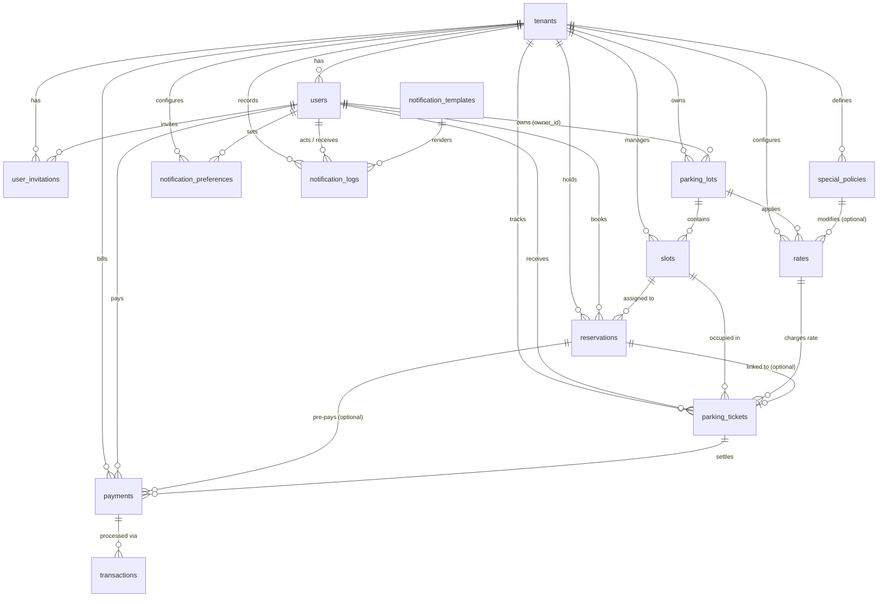

# Nivo Database Model & Architecture Report

Documented schema extracted directly from Flyway migrations (`V1` through `V27`) with current state, Entity-Relationship model, and architectural suggestions.

---

## 1. Schema Diagram (Mermaid ERD)



---

## 2. Composite Types & Custom Data Structures

### `address_t`
```sql
CREATE TYPE address_t AS (
    street   VARCHAR(255),
    city     VARCHAR(100),
    state    VARCHAR(100),
    country  VARCHAR(100),
    zip_code VARCHAR(20)
);
```

### `operating_hours_t`
```sql
CREATE TYPE operating_hours_t AS (
    open_time  TIME WITH TIME ZONE,
    close_time TIME WITH TIME ZONE
);
```

---

## 3. Data Dictionary (Tables)

### 3.1. `tenants`
Multi-tenant root organization.
| Column | Type | Nullable | Default / Constraint | Description |
|---|---|---|---|---|
| `id` | UUID | NO | PK | Tenant ID |
| `company_name` | VARCHAR(100) | NO | | Company or business name |
| `created_at` | TIMESTAMPTZ | YES | `CURRENT_TIMESTAMP` | Creation audit |
| `updated_at` | TIMESTAMPTZ | YES | `CURRENT_TIMESTAMP` | Update audit |
| `deleted_at` | TIMESTAMPTZ | YES | | Soft-delete timestamp |

---

### 3.2. `users`
System actors across roles and tenants.
| Column | Type | Nullable | Default / Constraint | Description |
|---|---|---|---|---|
| `id` | UUID | NO | PK | User ID |
| `tenant_id` | UUID | YES | FK -> `tenants(id)` ON DELETE RESTRICT | Associated tenant (NULL for Superadmins) |
| `full_name` | VARCHAR(100) | NO | | User full name |
| `email` | VARCHAR(100) | NO | Index `idx_users_email` | User login email |
| `password` | VARCHAR(255) | NO | | Hashed password |
| `role` | VARCHAR(20) | NO | CHECK in (`SUPERADMIN`, `OWNER`, `MANAGER`, `OPERATOR`, `DRIVER`, `AUDITOR`) | Access role |
| `contact_info` | TEXT | YES | | Optional contact data |
| `deleted_by` | UUID | YES | FK -> `users(id)` ON DELETE RESTRICT | User who performed soft delete |
| `created_at` | TIMESTAMPTZ | YES | `CURRENT_TIMESTAMP` | Creation audit |
| `updated_at` | TIMESTAMPTZ | YES | `CURRENT_TIMESTAMP` | Update audit |
| `deleted_at` | TIMESTAMPTZ | YES | | Soft-delete timestamp |

---

### 3.3. `user_invitations`
Tenant user onboarding tokens.
| Column | Type | Nullable | Default / Constraint | Description |
|---|---|---|---|---|
| `id` | UUID | NO | PK | Invitation ID |
| `tenant_id` | UUID | NO | FK -> `tenants(id)` | Target tenant |
| `invited_by` | UUID | NO | FK -> `users(id)` | Inviting user |
| `invited_email` | TEXT | NO | Index `idx_user_invitations_invited_email` | Target email |
| `role` | VARCHAR(20) | NO | CHECK in (`MANAGER`, `OPERATOR`, `DRIVER`, `AUDITOR`) | Assigned role upon acceptance |
| `token` | UUID | NO | | Invitation token |
| `status` | VARCHAR(20) | YES | DEFAULT `'PENDING'` CHECK in (`PENDING`, `ACCEPTED`, `EXPIRED`, `REVOKED`) | Invitation state |
| `created_at` | TIMESTAMPTZ | YES | `CURRENT_TIMESTAMP` | Sent date |
| `updated_at` | TIMESTAMPTZ | YES | `CURRENT_TIMESTAMP` | Update date |
| `accepted_at` | TIMESTAMPTZ | YES | | Acceptance timestamp |
| `expired_at` | TIMESTAMPTZ | YES | | Expiration timestamp |
| `deleted_at` | TIMESTAMPTZ | YES | | Soft-delete timestamp |

---

### 3.4. `parking_lots`
Physical parking facility entity.
| Column | Type | Nullable | Default / Constraint | Description |
|---|---|---|---|---|
| `id` | UUID | NO | PK | Lot ID |
| `tenant_id` | UUID | NO | FK -> `tenants(id)` | Tenant owner |
| `owner_id` | UUID | NO | FK -> `users(id)` | User owner/manager |
| `name` | VARCHAR(100) | NO | | Display name |
| `location_address` | `address_t` | NO | Composite type | Structured address |
| `timezone` | VARCHAR(50) | YES | DEFAULT `'UTC-5'` | Operating timezone |
| `currency` | VARCHAR(10) | YES | DEFAULT `'COP'` | Billing currency |
| `operating_hours` | `operating_hours_t` | YES | Composite type | Opening / closing hours |
| `coordinates` | `geography(POINT, 4326)` | YES | PostGIS | Geographic coordinate (Lat/Lng) |
| `created_at` | TIMESTAMPTZ | YES | `CURRENT_TIMESTAMP` | Creation audit |
| `updated_at` | TIMESTAMPTZ | YES | `CURRENT_TIMESTAMP` | Update audit |
| `deleted_at` | TIMESTAMPTZ | YES | | Soft-delete timestamp |

---

### 3.5. `slots`
Individual parking spots in a lot.
| Column | Type | Nullable | Default / Constraint | Description |
|---|---|---|---|---|
| `id` | UUID | NO | PK | Slot ID |
| `parking_lot_id` | UUID | NO | FK -> `parking_lots(id)` | Parking lot |
| `tenant_id` | UUID | NO | FK -> `tenants(id)` | Tenant context |
| `slot_number` | VARCHAR(20) | NO | | Number/code within lot |
| `prefix` | VARCHAR(20) | YES | | Spot prefix (e.g., A, B, VIP) |
| `type` | VARCHAR(50) | YES | DEFAULT `'car'` | Vehicle category (car, motorcycle, ev, disabled) |
| `zone` | VARCHAR(50) | YES | | Section/Floor/Zone |
| `status` | VARCHAR(20) | YES | DEFAULT `'AVAILABLE'` CHECK in (`AVAILABLE`, `OCCUPIED`, `RESERVED`, `MAINTENANCE`) | Real-time status |
| `created_at` | TIMESTAMPTZ | YES | `CURRENT_TIMESTAMP` | Creation audit |
| `updated_at` | TIMESTAMPTZ | YES | `CURRENT_TIMESTAMP` | Update audit |
| `deleted_at` | TIMESTAMPTZ | YES | | Soft-delete timestamp |

> **Unique Index**: Partial index `slots_slot_number_key` on `(parking_lot_id, slot_number, zone, prefix) WHERE deleted_at IS NULL`.

---

### 3.6. `special_policies`
Dynamic pricing rules and discount policies.
| Column | Type | Nullable | Default / Constraint | Description |
|---|---|---|---|---|
| `id` | UUID | NO | PK | Policy ID |
| `tenant_id` | UUID | NO | FK -> `tenants(id)` | Tenant context |
| `name` | TEXT | NO | | Policy description |
| `modifies` | VARCHAR(10) | YES | CHECK in (`PRICE`, `TIME`, `DISCOUNT`, `SURCHARGE`) | Target dimension |
| `operation` | VARCHAR(11) | YES | CHECK in (`SUBTRACT`, `PERCENTAGE`, `SET`) | Mathematical operation |
| `value_to_modify` | NUMERIC(10,2) | YES | CHECK >= 0, percentage bounded 0..100 | Value applied |
| `active` | BOOLEAN | YES | DEFAULT `TRUE` | Active flag |
| `created_at` | TIMESTAMPTZ | YES | `CURRENT_TIMESTAMP` | Creation audit |
| `updated_at` | TIMESTAMPTZ | YES | `CURRENT_TIMESTAMP` | Update audit |

---

### 3.7. `rates`
Parking fee structures.
| Column | Type | Nullable | Default / Constraint | Description |
|---|---|---|---|---|
| `id` | UUID | NO | PK | Rate ID |
| `parking_lot_id` | UUID | NO | FK -> `parking_lots(id)` | Target lot |
| `tenant_id` | UUID | NO | FK -> `tenants(id)` | Tenant context |
| `special_policy_id`| UUID | YES | FK -> `special_policies(id)` | Optional attached policy |
| `name` | TEXT | NO | | Rate name |
| `description` | VARCHAR(255) | NO | | Description |
| `price_per_unit` | DECIMAL(10, 2) | NO | | Price value |
| `time_unit` | VARCHAR(20) | NO | CHECK in (`MINUTES`, `HOURS`, `DAYS`) | Unit of duration |
| `min_charge_time_minutes` | INTEGER | YES | DEFAULT 0 | Grace / minimum charge threshold |
| `vehicle_type` | VARCHAR(50) | NO | CHECK in (`CAR`, `MOTORCYCLE`) | Vehicle category |
| `created_at` | TIMESTAMPTZ | YES | `CURRENT_TIMESTAMP` | Creation audit |
| `updated_at` | TIMESTAMPTZ | YES | `CURRENT_TIMESTAMP` | Update audit |
| `deleted_at` | TIMESTAMPTZ | YES | | Soft-delete timestamp |

---

### 3.8. `reservations`
Slot pre-booking records.
| Column | Type | Nullable | Default / Constraint | Description |
|---|---|---|---|---|
| `id` | UUID | NO | PK | Reservation ID |
| `tenant_id` | UUID | NO | FK -> `tenants(id)` | Tenant context |
| `user_id` | UUID | NO | FK -> `users(id)` | Driver / Client user |
| `slot_id` | UUID | NO | FK -> `slots(id)` | Reserved slot |
| `start_time` | TIMESTAMPTZ | NO | | Reservation window start |
| `end_time` | TIMESTAMPTZ | NO | | Reservation window end |
| `status` | VARCHAR(20) | YES | DEFAULT `'ACTIVE'` CHECK in (`ACTIVE`, `CANCELLED`, `COMPLETED`) | Reservation state |
| `payment_method` | VARCHAR(50) | YES | | Payment method code |
| `reservation_code` | VARCHAR(50) | YES | UNIQUE | Check-in reference code |
| `created_at` | TIMESTAMPTZ | YES | `CURRENT_TIMESTAMP` | Creation audit |
| `updated_at` | TIMESTAMPTZ | YES | `CURRENT_TIMESTAMP` | Update audit |
| `deleted_at` | TIMESTAMPTZ | YES | | Soft-delete timestamp |

---

### 3.9. `parking_tickets`
Active and historical parking sessions.
| Column | Type | Nullable | Default / Constraint | Description |
|---|---|---|---|---|
| `id` | UUID | NO | PK | Ticket ID |
| `tenant_id` | UUID | NO | FK -> `tenants(id)` | Tenant context |
| `user_id` | UUID | NO | FK -> `users(id)` | Driver user |
| `slot_id` | UUID | NO | FK -> `slots(id)` | Occupied slot |
| `rate_id` | UUID | NO | FK -> `rates(id)` | Applied rate |
| `reservation_id` | UUID | YES | FK -> `reservations(id)` | Associated reservation (optional) |
| `license_plate` | VARCHAR(20) | YES | | Vehicle license plate |
| `entry_time` | TIMESTAMPTZ | NO | | Ingress timestamp |
| `exit_time` | TIMESTAMPTZ | YES | | Egress timestamp |
| `total_to_charge` | DECIMAL(10, 2) | YES | | Calculated fee |
| `status` | VARCHAR(20) | YES | DEFAULT `'OPEN'` CHECK in (`OPEN`, `CLOSED`, `LOST`) | Ticket status |
| `closed_at` | TIMESTAMPTZ | YES | | Closing timestamp |
| `created_at` | TIMESTAMPTZ | YES | `CURRENT_TIMESTAMP` | Creation audit |
| `updated_at` | TIMESTAMPTZ | YES | `CURRENT_TIMESTAMP` | Update audit |
| `deleted_at` | TIMESTAMPTZ | YES | | Soft-delete timestamp |

> **Constraint**: `UNIQUE (tenant_id, id)`

---

### 3.10. `payments`
Financial collection records for tickets or reservations.
| Column | Type | Nullable | Default / Constraint | Description |
|---|---|---|---|---|
| `id` | UUID | NO | PK | Payment ID |
| `tenant_id` | UUID | NO | FK -> `tenants(id)` | Tenant context |
| `user_id` | UUID | NO | FK -> `users(id)` | Paying user |
| `parking_ticket_id` | UUID | NO | FK -> `parking_tickets(id)` | Target ticket |
| `reservation_id` | UUID | YES | FK -> `reservations(id)` | Target reservation |
| `amount` | DECIMAL(10, 2) | NO | | Monetary amount |
| `payment_date` | TIMESTAMPTZ | YES | `CURRENT_TIMESTAMP` | Timestamp |
| `payment_method` | VARCHAR(50) | NO | CHECK in (`PAY_LINK`, `EFFECTIVE`) | Method used |
| `status` | VARCHAR(20) | YES | DEFAULT `'PENDING'` CHECK in (`PENDING_CHECKOUT`, `PENDING_PAYMENT`, `PAID`, `FAILED`, `EXPIRED`, `CANCELLED`, `REFUNDED`) | Status |
| `provider` | VARCHAR(150) | YES | | Gateway provider (Wompi, Stripe, etc.) |
| `external_payment_id` | VARCHAR(100) | YES | | Gateway payment identifier |
| `checkout_session_id` | VARCHAR(100) | YES | Index `idx_checkout_session_id` | Checkout session ID |
| `checkout_url` | TEXT | YES | | Redirect/payment URL |
| `checkout_expires_at` | TIMESTAMPTZ | YES | Index `idx_checkout_expires_at` | Expiry threshold |
| `completed_at` | TIMESTAMPTZ | YES | | Completed date |
| `provider_create_response` | JSONB | YES | `jsonb_typeof() = 'object'` | Provider metadata response payload |
| `created_at` | TIMESTAMPTZ | YES | `CURRENT_TIMESTAMP` | Creation audit |
| `updated_at` | TIMESTAMPTZ | YES | `CURRENT_TIMESTAMP` | Update audit |
| `deleted_at` | TIMESTAMPTZ | YES | | Soft-delete timestamp |

> **Unique Index**: Partial index `ux_payment_one_completed_per_ticket` on `(tenant_id, parking_ticket_id) WHERE status = 'PAID'`.

---

### 3.11. `transactions`
Payment gateway execution logs / ledger.
| Column | Type | Nullable | Default / Constraint | Description |
|---|---|---|---|---|
| `id` | UUID | NO | PK | Transaction ID |
| `payment_id` | UUID | NO | FK -> `payments(id)` | Parent payment |
| `supplier_ref` | VARCHAR(50) | YES | UNIQUE | Supplier transaction reference |
| `transaction_id` | VARCHAR(50) | YES | | External transaction ID |
| `payment_provider` | VARCHAR(50) | NO | | Provider identifier |
| `amount` | DECIMAL(10, 2) | NO | | Amount charged |
| `currency` | VARCHAR(10) | NO | | Currency (COP, USD) |
| `status` | VARCHAR(20) | NO | | Status result |
| `gateway_response` | TEXT | YES | | Raw response from provider |
| `created_at` | TIMESTAMPTZ | YES | `CURRENT_TIMESTAMP` | Transaction timestamp |

> **Constraint**: `UNIQUE (supplier_ref, payment_id, status)`

---

### 3.12. `notification_templates`
Message layout definitions for system events.
| Column | Type | Nullable | Default / Constraint | Description |
|---|---|---|---|---|
| `id` | UUID | NO | PK | Template ID |
| `name` | VARCHAR(100) | NO | | Template identifier name |
| `event_type` | VARCHAR(50) | NO | CHECK (see Event Types below) | Trigger event category |
| `channel` | VARCHAR(20) | NO | CHECK in (`EMAIL`, `WHATSAPP`) | Delivery channel |
| `template_reference` | VARCHAR(255) | YES | | External reference |
| `body` | TEXT | NO | | Body / mustache markup |
| `is_active` | BOOLEAN | NO | DEFAULT `TRUE` | Active toggle |
| `created_at` | TIMESTAMPTZ | YES | `CURRENT_TIMESTAMP` | Creation audit |
| `updated_at` | TIMESTAMPTZ | YES | `CURRENT_TIMESTAMP` | Update audit |
| `deleted_at` | TIMESTAMPTZ | YES | | Soft-delete timestamp |

---

### 3.13. `notification_preferences`
Per-user notification delivery matrix.
| Column | Type | Nullable | Default / Constraint | Description |
|---|---|---|---|---|
| `id` | UUID | NO | PK | Preference ID |
| `user_id` | UUID | NO | FK -> `users(id)` ON DELETE CASCADE | Target user |
| `tenant_id` | UUID | NO | FK -> `tenants(id)` ON DELETE RESTRICT | Tenant context |
| `event_type` | VARCHAR(50) | NO | CHECK (see Event Types below) | Event category |
| `channel` | VARCHAR(20) | NO | CHECK in (`EMAIL`, `WHATSAPP`) | Channel |
| `is_enabled` | BOOLEAN | NO | DEFAULT `TRUE` | User opt-in/opt-out |
| `created_at` | TIMESTAMPTZ | YES | `CURRENT_TIMESTAMP` | Creation audit |
| `updated_at` | TIMESTAMPTZ | YES | `CURRENT_TIMESTAMP` | Update audit |

> **Constraint**: `UNIQUE (user_id, event_type, channel)`  
> **Trigger**: `trg_user_default_notification_preferences` auto-populates all channels × event types upon `INSERT` on `users`.

---

### 3.14. `notification_logs`
Historical outbound notification audit trail.
| Column | Type | Nullable | Default / Constraint | Description |
|---|---|---|---|---|
| `id` | UUID | NO | PK | Notification Log ID |
| `tenant_id` | UUID | NO | FK -> `tenants(id)` ON DELETE RESTRICT | Tenant context |
| `actor_user_id` | UUID | NO | FK -> `users(id)` ON DELETE RESTRICT | Actor triggering the notification |
| `recipient_user_id` | UUID | YES | FK -> `users(id)` ON DELETE SET NULL | Destination user |
| `template_id` | UUID | YES | FK -> `notification_templates(id)` ON DELETE SET NULL | Template used |
| `event_type` | VARCHAR(50) | NO | CHECK (see Event Types below) | Event type |
| `channel` | VARCHAR(20) | NO | CHECK in (`EMAIL`, `WHATSAPP`) | Channel used |
| `recipient` | VARCHAR(255) | NO | | Destination email / phone |
| `subject` | VARCHAR(255) | YES | | Notification subject |
| `body` | TEXT | YES | | Rendered payload content |
| `status` | VARCHAR(20) | NO | DEFAULT `'PENDING'` CHECK in (`PENDING`, `SENT`, `FAILED`) | Delivery state |
| `error_message` | TEXT | YES | | Error details if failed |
| `sent_at` | TIMESTAMPTZ | YES | | Dispatch timestamp |
| `created_at` | TIMESTAMPTZ | YES | `CURRENT_TIMESTAMP` | Creation timestamp |

---

## 4. Shared Domain Enums / Check Constraints

### Notification Event Types
* `RESERVATION_CREATED`
* `TICKET_OPENED`
* `TICKET_CLOSED`
* `PAYMENT_COMPLETED`
* `PAYMENT_CHECKOUT`
* `USER_SELF_REGISTERED`
* `USER_INVITED`
* `USER_INVITATION_ACCEPTED`
* `USER_ROLE_ASSIGNED`

### User Roles
* `SUPERADMIN`, `OWNER`, `MANAGER`, `OPERATOR`, `DRIVER`, `AUDITOR`

### Payment Statuses
* `PENDING_CHECKOUT`, `PENDING_PAYMENT`, `PAID`, `FAILED`, `EXPIRED`, `CANCELLED`, `REFUNDED`

---

## 5. Architectural Findings & Suggestions

### 1. Hardcoded Schema Names in Migrations (Portability Issue)
* **Finding**: Migrations `V12`, `V13`, `V14`, `V17`, `V18` reference `"nivo_db".nivo.<table_name>` explicitly in SQL statements.
* **Risk**: Breaks local testing against H2, Testcontainers, or environments with different database names (e.g. `nivo_test` or `postgres`).
* **Suggestion**: Rely on PostgreSQL `search_path` (e.g., `SET search_path TO nivo, public;`) or Flyway's `defaultSchema` placeholders rather than hardcoded database/schema prefixes.

### 2. Composite Types (`address_t` & `operating_hours_t`) vs JSONB / Embedded Flat Columns
* **Finding**: `parking_lots` uses PostgreSQL User Defined Types (UDTs).
* **Trade-off**: Required migrations `V26` and `V27` to fix field ordering because Hibernate 6 `@Struct` serializes fields by attribute position.
* **Suggestion**: Consider migrating composite types to either **flat columns** (e.g., `address_street`, `address_city`, `operating_hours_open`) or **JSONB**. Flat columns maintain clean JPA/Hibernate mapping without UDT serialization ordering fragility.

### 3. Soft-Delete Consistency & Multi-Tenant Unique Constraints
* **Finding**: `slots` handles soft-delete uniqueness properly via `CREATE UNIQUE INDEX ... WHERE deleted_at IS NULL` (in `V25`). However:
  * `users(email)` does not account for `deleted_at`, preventing re-registration if a user was deleted.
  * `user_invitations` lacks a partial unique index on `(tenant_id, invited_email) WHERE status = 'PENDING'`.
* **Suggestion**: Convert standard unique constraints to partial indexes `WHERE deleted_at IS NULL` (or active status) across `users` and `user_invitations`.

### 4. Dynamic Trigger Parsing Check Constraints (`V20`)
* **Finding**: Function `get_check_constraint_values` parses regex out of `pg_constraint.conkey` to auto-populate notification preferences.
* **Risk**: Brittle when constraint definitions format differently across PostgreSQL versions or cloud environments (e.g., Aurora, Supabase, Neon), and incompatible with H2 integration tests.
* **Suggestion**: Store event types and channels in lookup/seed tables (`notification_channels`, `notification_events`) with standard foreign keys, or manage default creation in application domain use cases.

### 5. Foreign Key Cascades & Archival Strategy
* **Finding**: `notification_logs` and `parking_tickets` contain high-volume transactional data referencing `users` and `tenants` with `ON DELETE RESTRICT`.
* **Suggestion**: Add composite indexes on `(tenant_id, created_at)` for `parking_tickets`, `payments`, and `notification_logs` to accelerate time-window partitioning, tenant metrics, and historical data archiving.
