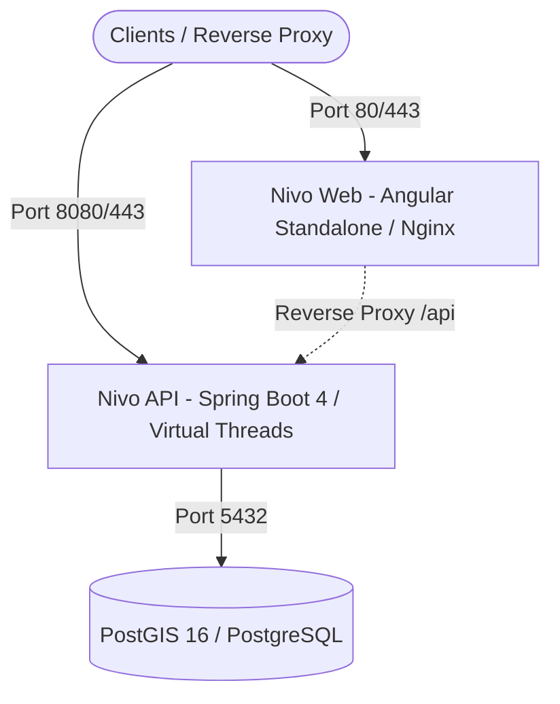

# Homelab & Self-Hosted Production Deployment Guide

This guide outlines the complete end-to-end instructions for deploying the **Nivo** Multi-Tenant SaaS Parking Platform on a self-hosted Homelab or VPS infrastructure using Docker Compose.

---

## 1. Architecture Overview

The production stack consists of three containerized services connected via an internal Docker bridge network (`nivo_net`):



- **Nivo Web**: Production Angular standalone client served via Nginx with automated gzip and static caching.
- **Nivo API**: Spring Boot application running on Java 25 with Virtual Threads enabled, Clean Architecture, and Log4j2.
- **Database**: PostgreSQL 16 with PostGIS spatial extension enabled (`nivo` schema).

---

## 2. Prerequisites

- **Linux Host** (Ubuntu 22.04/24.04 LTS, Debian 12, or similar)
- **Docker Engine** (v26.0+) & **Docker Compose** (v2.24+)
- **OpenSSL** CLI
- **Domain Name** pointing to your host with a configured reverse proxy (Caddy, Traefik, Nginx, or Cloudflare Tunnel)

---

## 3. Cryptography & Secrets Preparation

### Step 1: Generate RSA Key Pair for JWT Verification

You can either bundle keys into the build (embedded classpath) or externalize them via Docker volume mounts (**recommended for production** to allow key rotation without image rebuilds).

#### Option A: External Keys via Volume Mount (Recommended for Production)
```bash
mkdir -p deployment/keys

# Generate private key
openssl genrsa -out deployment/keys/private.pem 2048

# Extract public key
openssl rsa -in deployment/keys/private.pem -pubout -out deployment/keys/public.pem

chmod 600 deployment/keys/private.pem
chmod 644 deployment/keys/public.pem
```

Configure `deployment/.env` to point to the mounted container path:
```dotenv
RSA_PUBLIC_KEY_LOCATION=file:/app/keys/public.pem
RSA_PRIVATE_KEY_LOCATION=file:/app/keys/private.pem
RSA_KEYS_DIR=./keys
RSA_KEY_ID=nivo-prod-key-v1
```

#### Option B: Embedded Classpath Keys (Development / Build-time)
```bash
mkdir -p apps/api/applications/app-service/src/main/resources/keys

# Generate private key
openssl genrsa -out apps/api/applications/app-service/src/main/resources/keys/private.pem 2048

# Extract public key
openssl rsa -in apps/api/applications/app-service/src/main/resources/keys/private.pem -pubout -out apps/api/applications/app-service/src/main/resources/keys/public.pem
```

### Step 2: Generate AES Secret
```bash
# Generate 256-bit AES secret key
AES_KEY=$(openssl rand -base64 32)
echo "AES_SECRET_KEY: $AES_KEY"
```

---

## 4. Environment Configuration

Copy the example environment template and configure your production values:

```bash
cp .env.example deployment/.env
chmod 600 deployment/.env
nano deployment/.env
```

Key parameters to verify in `deployment/.env`:
- `POSTGRES_PASSWORD`: Strong generated database password.
- `DB_URL`: `jdbc:postgresql://database:5432/nivo_db?currentSchema=nivo`
- `SPRING_PROFILES_ACTIVE`: `prod`
- `CORS_ALLOWED_ORIGINS`: Comma-separated list of your production domains (e.g. `https://nivo.yourdomain.com`).

---

## 5. Resource Limits & Sizing Tuning

All services configured in `deployment/compose.yaml` define resource limits (maximum allowable cap) and reservations (minimum guaranteed allocation) to ensure stability in multi-tenant or constrained homelab hardware.

### Default Resource Allocation

| Service | Variable (Limit) | Default Limit | Variable (Reservation) | Default Reservation |
| :--- | :--- | :--- | :--- | :--- |
| **Nivo Web** | `WEB_CPU_LIMIT` / `WEB_MEM_LIMIT` | `0.50` CPU, `256M` RAM | `WEB_CPU_RESERVATION` / `WEB_MEM_RESERVATION` | `0.10` CPU, `64M` RAM |
| **Nivo API** | `API_CPU_LIMIT` / `API_MEM_LIMIT` | `2.0` CPU, `1024M` RAM | `API_CPU_RESERVATION` / `API_MEM_RESERVATION` | `0.25` CPU, `512M` RAM |
| **PostGIS DB** | `DB_CPU_LIMIT` / `DB_MEM_LIMIT` | `2.0` CPU, `1024M` RAM | `DB_CPU_RESERVATION` / `DB_MEM_RESERVATION` | `0.25` CPU, `256M` RAM |

### Tuning Recommendations for Homelab Servers

- **Low-Power / Mini PCs (e.g., 4GB RAM, 2-4 cores)**:
  - Keep default or slightly conservative memory limits (e.g., `API_MEM_LIMIT=768M`, `DB_MEM_LIMIT=768M`).
  - Ensure reservations do not exceed total available host memory (`WEB: 64M` + `API: 512M` + `DB: 256M` = `~832M` base reserved).
- **High-Throughput / Dedicated Nodes (e.g., 16GB+ RAM, 8+ cores)**:
  - Increase `API_MEM_LIMIT=2048M`, `API_MEM_RESERVATION=1024M` to give Java Virtual Threads and caching more headroom.
  - Increase `DB_MEM_LIMIT=4096M`, `DB_MEM_RESERVATION=1024M` and adjust PostgreSQL `shared_buffers` accordingly for large spatial datasets.

To override defaults, configure the corresponding variables in your `deployment/.env` file.

---

## 6. Starting the Stack

Execute the compose launch command:

```bash
docker compose --env-file deployment/.env -f deployment/compose.yaml up -d --build
```

Monitor startup logs:
```bash
docker compose -f deployment/compose.yaml logs -f
```

---

## 7. Reverse Proxy Integration Examples

### Caddy (Recommended)
```caddy
nivo.yourdomain.com {
    reverse_proxy localhost:80
}

api.nivo.yourdomain.com {
    reverse_proxy localhost:8080
}
```

### Nginx
```nginx
server {
    listen 443 ssl http2;
    server_name nivo.yourdomain.com;

    ssl_certificate /etc/letsencrypt/live/nivo.yourdomain.com/fullchain.pem;
    ssl_certificate_key /etc/letsencrypt/live/nivo.yourdomain.com/privkey.pem;

    location / {
        proxy_pass http://127.0.0.1:80;
        proxy_set_header Host $host;
        proxy_set_header X-Real-IP $remote_addr;
        proxy_set_header X-Forwarded-For $proxy_add_x_forwarded_for;
        proxy_set_header X-Forwarded-Proto $scheme;
    }
}

server {
    listen 443 ssl http2;
    server_name api.nivo.yourdomain.com;

    ssl_certificate /etc/letsencrypt/live/api.nivo.yourdomain.com/fullchain.pem;
    ssl_certificate_key /etc/letsencrypt/live/api.nivo.yourdomain.com/privkey.pem;

    location / {
        proxy_pass http://127.0.0.1:8080;
        proxy_set_header Host $host;
        proxy_set_header X-Real-IP $remote_addr;
        proxy_set_header X-Forwarded-For $proxy_add_x_forwarded_for;
        proxy_set_header X-Forwarded-Proto $scheme;
    }
}
```

---

## 8. PostGIS Schema & Migrations Verification

Verify that the schema and spatial extensions are active:

```bash
docker exec -it nivo_database psql -U postgres -d nivo_db -c "\dn"
docker exec -it nivo_database psql -U postgres -d nivo_db -c "SELECT PostGIS_Version();"
```

---

## 9. Backup & Restore Procedures

### Automated Backup Script (`backup.sh`)
```bash
#!/usr/bin/env bash
BACKUP_DIR="/backups/nivo"
TIMESTAMP=$(date +"%Y%m%d_%H%M%S")
mkdir -p "$BACKUP_DIR"

docker exec nivo_database pg_dump -U postgres -d nivo_db -F c -b -v -f "/tmp/backup_$TIMESTAMP.dump"
docker cp nivo_database:/tmp/backup_$TIMESTAMP.dump "$BACKUP_DIR/nivo_db_$TIMESTAMP.dump"
docker exec nivo_database rm "/tmp/backup_$TIMESTAMP.dump"

# Keep last 14 days of backups
find "$BACKUP_DIR" -type f -name "*.dump" -mtime +14 -delete
```

### Restore Database
```bash
docker cp /backups/nivo/nivo_db_YYYYMMDD_HHMMSS.dump nivo_database:/tmp/restore.dump
docker exec -it nivo_database pg_restore -U postgres -d nivo_db --clean --if-exists /tmp/restore.dump
docker exec -it nivo_database rm /tmp/restore.dump
```

---

## 10. Health Checks & Monitoring

- **Spring Boot Health Probe**: `http://localhost:8080/api/actuator/health`
- **Prometheus Metrics**: `http://localhost:8080/api/actuator/prometheus`
- **Docker Container Health**: `docker compose -f deployment/compose.yaml ps`

---

## 11. Zero-Rebuild RSA Key Rotation Procedure

When utilizing the external volume mount (`${RSA_KEYS_DIR:-./keys}:/app/keys:ro`), RSA cryptographic keys can be rotated without rebuilding or redeploying Docker container images.

### Step-by-Step Key Rotation

1. **Generate New RSA Key Pair**:
   Create new keys in your host's keys directory (e.g. `./deployment/keys`):
   ```bash
   # Generate new private key
   openssl genrsa -out deployment/keys/private.pem 2048

   # Extract public key
   openssl rsa -in deployment/keys/private.pem -pubout -out deployment/keys/public.pem

   # Secure file permissions
   chmod 600 deployment/keys/private.pem
   chmod 644 deployment/keys/public.pem
   ```

2. **Update Key ID (Optional but Recommended)**:
   In `deployment/.env`, update `RSA_KEY_ID` to represent the new key version (e.g. `nivo-prod-key-v2`):
   ```dotenv
   RSA_KEY_ID=nivo-prod-key-v2
   ```

3. **Restart the API Service**:
   Restart the API container so Spring Boot reloads the new RSA keys and re-initializes the JWT Nimbus encoder/decoder:
   ```bash
   docker compose --env-file deployment/.env -f deployment/compose.yaml restart api
   ```

4. **Verify Health & Key Loading**:
   ```bash
   docker compose -f deployment/compose.yaml ps api
   curl -s http://localhost:8080/api/actuator/health
   ```
   Inspect API logs to verify clean startup:
   ```bash
   docker compose -f deployment/compose.yaml logs --tail=50 api
   ```
