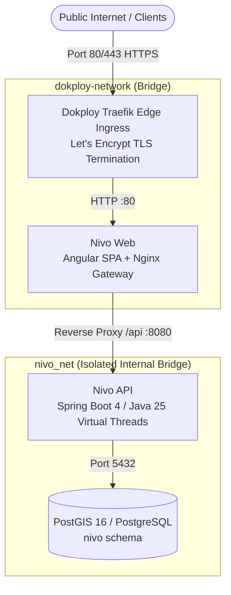

# Homelab & Dokploy Self-Hosted Production Deployment Guide

This guide outlines the complete end-to-end instructions for deploying the **Nivo** Multi-Tenant SaaS Parking Platform on a self-hosted Homelab or VPS infrastructure using **Dokploy** and **Docker Compose** with native **Traefik** reverse proxy integration.

---

## 1. Architecture Overview

The deployment operates as a secured 2-tier reverse proxy architecture:



### Flow Breakdown:
1. **Tier 1: Dokploy Traefik (Edge Ingress & SSL)**:
   - Receives HTTPS traffic on port 443.
   - Automatically issues and renews TLS certificates via Let's Encrypt (`certresolver: letsencrypt`).
   - Routes traffic based on Host header (`Host(${DOMAIN_NAME})`) directly to the `web` container over the shared `dokploy-network`.
2. **Tier 2: Internal Nginx (Web Client & API Gateway)**:
   - Serves pre-compiled Angular SPA static assets with compression (gzip) and caching headers.
   - Proxies all `/api/*` requests internally to `http://api:8080` over the private `nivo_net` network.
3. **Backend & Persistence (Private Network)**:
   - **Nivo API**: Spring Boot 4 running on Java 25 with Virtual Threads enabled, Clean Architecture, and Nimbus JWT cryptographic verification.
   - **Database**: PostgreSQL 16 with PostGIS spatial extension enabled (`nivo` schema).

---

## 2. Prerequisites

- **Linux Host / VPS** (Ubuntu 22.04/24.04 LTS, Debian 12, or similar).
- **Dokploy** installed and running on your host (or Docker Engine v26.0+ & Docker Compose v2.24+).
- **OpenSSL CLI** (for RSA and AES key generation).
- **Domain Name** with DNS `A`/`AAAA` or `CNAME` records pointing to your server's public IP address.
- **GitHub Container Registry (GHCR)**: Pre-built images are hosted at:
  - `ghcr.io/juniorcorzo/nivo-web:latest`
  - `ghcr.io/juniorcorzo/nivo-api:latest`

  > [!NOTE]
  > In Dokploy and production deployments, Docker Compose directly pulls these pre-built GHCR images rather than compiling from source, significantly saving CPU and RAM overhead on the homelab host. For local development or custom builds, an override file (`deployment/compose.build.yaml`) is provided.

> [!TIP]
> **Authenticating Dokploy / Docker to GHCR**:
> If the GitHub packages/images are private, authenticate your Docker daemon before pulling:
> ```bash
> docker login ghcr.io -u <username> -p <github_pat>
> ```
> In Dokploy, you can also configure private registry credentials under **Settings** > **Registries** with Registry URL `ghcr.io`, your GitHub username, and a GitHub Personal Access Token (PAT) having `read:packages` scope.

---

## 3. Cryptography & Secrets Preparation

Before launching the stack, generate the necessary cryptographic keys for JWT tokens and sensitive credential encryption.

### Step 1: Generate RSA Key Pair for JWT Signing & Verification

We recommend using external volume-mounted keys (`${RSA_KEYS_DIR:-./keys}:/app/keys:ro`) to allow key rotation without image rebuilds.

```bash
mkdir -p deployment/keys
chmod 755 deployment/keys

# Generate RSA 2048-bit private key
openssl genrsa -out deployment/keys/private.pem 2048

# Extract corresponding public key
openssl rsa -in deployment/keys/private.pem -pubout -out deployment/keys/public.pem

# Set permissions (chmod 644 so non-root container user can read keys mounted read-only)
chmod 644 deployment/keys/private.pem
chmod 644 deployment/keys/public.pem
```

> [!NOTE]
> Because the container runs as a non-root user (`USER nivo`), `chmod 600` owned by root on the host prevents the container from reading `private.pem`. With `chmod 644` on the keys and `chmod 755` on the keys directory, plus the container volume mounted as read-only (`:ro`), `USER nivo` can safely read the keys.

Configure `RSA_` variables in your `.env` file:
```dotenv
RSA_PUBLIC_KEY_LOCATION=file:/app/keys/public.pem
RSA_PRIVATE_KEY_LOCATION=file:/app/keys/private.pem
RSA_KEYS_DIR=./keys
RSA_KEY_ID=nivo-prod-key-v1
```

### Step 2: Generate AES Secret Key

Generate a 256-bit AES secret key (Base64-encoded) for encrypting stored tenant credentials:

```bash
AES_KEY=$(openssl rand -base64 32)
echo "AES_SECRET_KEY: $AES_KEY"
```

---

## 4. Environment Configuration

Copy the configuration template to `deployment/.env`:

```bash
cp deployment/.env.example deployment/.env
chmod 600 deployment/.env
```

Review and customize the environment variables:

```dotenv
# --- Container Images (GHCR) ---
WEB_IMAGE=ghcr.io/juniorcorzo/nivo-web:latest
API_IMAGE=ghcr.io/juniorcorzo/nivo-api:latest

# --- Dokploy & Traefik Integration ---
DOKPLOY_NETWORK=dokploy-network
TRAEFIK_ENABLED=true
TRAEFIK_ENTRYPOINT=websecure
TRAEFIK_CERT_RESOLVER=letsencrypt
DOMAIN_NAME=nivo.yourdomain.com

# --- Database (PostGIS) ---
POSTGRES_DB=nivo_db
POSTGRES_USER=postgres
POSTGRES_PASSWORD=your_strong_generated_password
DB_URL=jdbc:postgresql://database:5432/nivo_db?currentSchema=nivo
DB_USERNAME=postgres
DB_PASSWORD=your_strong_generated_password

# --- Security & JWT ---
JWT_ISSUE=https://nivo.yourdomain.com
AES_SECRET_KEY=<output_from_openssl_rand_base64_32>
RSA_KEY_ID=nivo-prod-key-v1
RSA_PUBLIC_KEY_LOCATION=file:/app/keys/public.pem
RSA_PRIVATE_KEY_LOCATION=file:/app/keys/private.pem
RSA_KEYS_DIR=./keys

# --- CORS & Origins ---
CORS_ALLOWED_ORIGINS=https://nivo.yourdomain.com
```

---

## 5. Dokploy & Traefik Deployment Guide

Nivo includes built-in Traefik labels and multi-network definitions inside `deployment/compose.yaml` for seamless integration with Dokploy.

### How Dokploy Traefik Works

Dokploy manages a central Traefik container listening on host ports 80 and 443, connected to an external Docker network named `dokploy-network`.

- When Nivo is deployed, the `web` container joins both `nivo_net` (internal communication) and `dokploy-network` (ingress proxying).
- Traefik dynamically discovers the `web` container using Docker labels.
- The `api` and `database` containers remain isolated in `nivo_net` with no external exposure.

### Traefik Routing Rules & Labels

The Compose file declares the Traefik routing configuration using YAML anchors:

```yaml
x-traefik-web-labels: &traefik-web-labels
  - "traefik.enable=${TRAEFIK_ENABLED:-true}"
  - "traefik.http.routers.nivo-web.rule=Host(`${DOMAIN_NAME:-localhost}`)"
  - "traefik.http.routers.nivo-web.entrypoints=${TRAEFIK_ENTRYPOINT:-websecure}"
  - "traefik.http.routers.nivo-web.tls.certresolver=${TRAEFIK_CERT_RESOLVER:-letsencrypt}"
  - "traefik.http.services.nivo-web.loadbalancer.server.port=80"
```

- `traefik.enable`: Activates Traefik routing for the service.
- `traefik.http.routers.nivo-web.rule`: Matches incoming HTTP requests with the target host `DOMAIN_NAME`.
- `traefik.http.routers.nivo-web.entrypoints`: Directs HTTPS traffic through the `websecure` (port 443) entrypoint.
- `traefik.http.routers.nivo-web.tls.certresolver`: Automatically provisions SSL/TLS certificates via Let's Encrypt.
- `traefik.http.services.nivo-web.loadbalancer.server.port=80`: Proxies requests directly to port 80 inside the `web` container.

### Zero Host Port Conflicts

In Dokploy and production Traefik homelab setups, host ports `80` and `443` are already bound and managed by Traefik. Attempting to bind `0.0.0.0:80` on individual service containers causes Docker to fail with `"port is already allocated"`.

To guarantee zero host port collisions:
- In `deployment/compose.yaml`, **no host ports (`ports:`) are published** for `web`, `api`, or `database`.
- **Traefik Ingress**: Traefik discovers the `web` container via Docker labels and routes external HTTP/HTTPS traffic directly to the container's internal port `80` (`traefik.http.services.nivo-web.loadbalancer.server.port=80`) across the shared `dokploy-network`.
- **Internal Service Isolation**: The `web` container proxies `/api/*` requests internally to `http://api:8080` over the private `nivo_net` bridge network, and `api` communicates with `database:5432` without exposing PostgreSQL ports to the host network.
- **Local Development**: If you need host port mappings for local development, use `deployment/compose.dev.yaml` or an override file.

---

### Step-by-Step Setup in Dokploy

#### Step 1: Create a Compose Project in Dokploy
1. Open your Dokploy dashboard.
2. Navigate to **Projects** -> Select your Project -> **Add Service** -> **Compose**.
3. Choose **Docker Compose** as the deployment type.
4. Point the source to your Git repository:
   - **Repository URL**: `https://github.com/juniorcorzo/nivo.git` (or your private fork)
   - **Branch**: `main`
   - **Compose Path**: `deployment/compose.yaml`

#### Step 2: Configure Environment Variables in Dokploy UI
1. In the Dokploy service dashboard, navigate to the **Environment** tab.
2. Paste the contents of your customized `.env` file into the editor.
3. Ensure `DOMAIN_NAME` matches the domain configured in your DNS records.

#### Step 3: Configure Volumes and Mounts for RSA Keys
1. In the **Volumes / Mounts** section (or on the host filesystem), ensure the RSA key directory exists:
   - Host path: `/etc/dokploy/nivo/keys` (or your project keys path)
   - Mounted path: `./keys` (relative to compose working dir) or specify absolute path in `RSA_KEYS_DIR`.
2. Ensure `deployment/init.sh` has executable permissions.

#### Step 4: Deploy & Verify
1. Click **Deploy** in the Dokploy dashboard.
2. Dokploy will pull the pre-built GHCR images directly (saving host CPU/RAM), launch containers, and connect the `web` service to `dokploy-network`.
3. Traefik will automatically obtain Let's Encrypt SSL certificates for your `DOMAIN_NAME`.
4. Access `https://nivo.yourdomain.com` in your browser.

---

## 6. Standalone Docker Compose Deployment

If you are running on a standalone Docker host without Dokploy:

1. Ensure the external bridge network exists (or create it):
   ```bash
   docker network create dokploy-network || true
   ```
2. Pull the latest pre-built images and start the stack:
   ```bash
   docker compose --env-file deployment/.env -f deployment/compose.yaml pull
   docker compose --env-file deployment/.env -f deployment/compose.yaml up -d
   ```
3. *(Optional)* If you need to build container images locally instead of pulling from GHCR:
   ```bash
   bun run docker:build
   # Or directly with Docker Compose:
   docker compose -f deployment/compose.yaml -f deployment/compose.build.yaml build
   ```
4. Check container status:
   ```bash
   docker compose -f deployment/compose.yaml ps
   ```

---

## 7. Resource Limits & Sizing Tuning

All services configured in `deployment/compose.yaml` define resource limits (maximum allowable cap) and reservations (minimum guaranteed allocation).

### Default Resource Allocation

| Service | Limit Variable | Default Limit | Reservation Variable | Default Reservation |
| :--- | :--- | :--- | :--- | :--- |
| **Nivo Web** | `WEB_CPU_LIMIT` / `WEB_MEM_LIMIT` | `0.50` CPU, `256M` RAM | `WEB_CPU_RESERVATION` / `WEB_MEM_RESERVATION` | `0.10` CPU, `64M` RAM |
| **Nivo API** | `API_CPU_LIMIT` / `API_MEM_LIMIT` | `2.0` CPU, `1024M` RAM | `API_CPU_RESERVATION` / `API_MEM_RESERVATION` | `0.25` CPU, `512M` RAM |
| **PostGIS DB** | `DB_CPU_LIMIT` / `DB_MEM_LIMIT` | `2.0` CPU, `1024M` RAM | `DB_CPU_RESERVATION` / `DB_MEM_RESERVATION` | `0.25` CPU, `256M` RAM |

### Tuning Guidelines

- **Constrained Servers (2-4 Cores, 4GB RAM)**:
  - Keep default memory limits (`API_MEM_LIMIT=1024M`, `DB_MEM_LIMIT=1024M`).
  - Total reservations require `~832M` guaranteed RAM (`64M` + `512M` + `256M`).
- **Production High-Throughput (8+ Cores, 16GB+ RAM)**:
  - Increase `API_MEM_LIMIT=2048M`, `API_MEM_RESERVATION=1024M` to provide additional headroom for Java Virtual Threads.
  - Increase `DB_MEM_LIMIT=4096M`, `DB_MEM_RESERVATION=1024M` for heavy spatial operations.

---

## 8. PostGIS Schema & Migrations Verification

Verify that the PostGIS database and `nivo` schema initialized successfully:

```bash
docker exec -it nivo_database psql -U postgres -d nivo_db -c "\dn"
docker exec -it nivo_database psql -U postgres -d nivo_db -c "SELECT PostGIS_Version();"
```

Expected schema output includes `nivo` and `public`.

---

## 9. Zero-Rebuild RSA Key Rotation Procedure

When using the external volume mount (`${RSA_KEYS_DIR:-./keys}:/app/keys:ro`), RSA cryptographic keys can be rotated without rebuilding container images.

### Key Rotation Steps:

1. **Generate New Key Pair**:
   ```bash
   mkdir -p deployment/keys
   chmod 755 deployment/keys
   openssl genrsa -out deployment/keys/private.pem 2048
   openssl rsa -in deployment/keys/private.pem -pubout -out deployment/keys/public.pem
   chmod 644 deployment/keys/private.pem
   chmod 644 deployment/keys/public.pem
   ```

2. **Update Key ID in `.env`**:
   ```dotenv
   RSA_KEY_ID=nivo-prod-key-v2
   ```

3. **Restart the API Container**:
   ```bash
   docker compose --env-file deployment/.env -f deployment/compose.yaml restart api
   ```

4. **Verify Startup**:
   ```bash
   docker compose -f deployment/compose.yaml logs --tail=50 api
   docker compose -f deployment/compose.yaml exec api wget -q -O- http://localhost:8080/api/actuator/health
   # Or from external domain:
   curl -s https://nivo.yourdomain.com/api/actuator/health
   ```

---

## 10. Health Checks & Monitoring

- **Container Status**: `docker compose -f deployment/compose.yaml ps`
- **API Actuator Health Probe**: `docker compose -f deployment/compose.yaml exec api wget -q -O- http://localhost:8080/api/actuator/health` (or `https://nivo.yourdomain.com/api/actuator/health`)
- **Web Client Health Probe**: `https://nivo.yourdomain.com/health`
- **Prometheus Metrics**: `docker compose -f deployment/compose.yaml exec api wget -q -O- http://localhost:8080/api/actuator/prometheus`

---

## 11. Backup & Restore Procedures

### Automated Database Backup Script (`backup.sh`)

```bash
#!/usr/bin/env bash
set -euo pipefail

BACKUP_DIR="/backups/nivo"
TIMESTAMP=$(date +"%Y%m%d_%H%M%S")
mkdir -p "$BACKUP_DIR"

docker exec nivo_database pg_dump -U postgres -d nivo_db -F c -b -v -f "/tmp/backup_$TIMESTAMP.dump"
docker cp nivo_database:/tmp/backup_$TIMESTAMP.dump "$BACKUP_DIR/nivo_db_$TIMESTAMP.dump"
docker exec nivo_database rm "/tmp/backup_$TIMESTAMP.dump"

# Retain backups for 14 days
find "$BACKUP_DIR" -type f -name "*.dump" -mtime +14 -delete
```

### Database Restore Procedure

```bash
docker cp /backups/nivo/nivo_db_YYYYMMDD_HHMMSS.dump nivo_database:/tmp/restore.dump
docker exec -it nivo_database pg_restore -U postgres -d nivo_db --clean --if-exists /tmp/restore.dump
docker exec -it nivo_database rm /tmp/restore.dump
```
