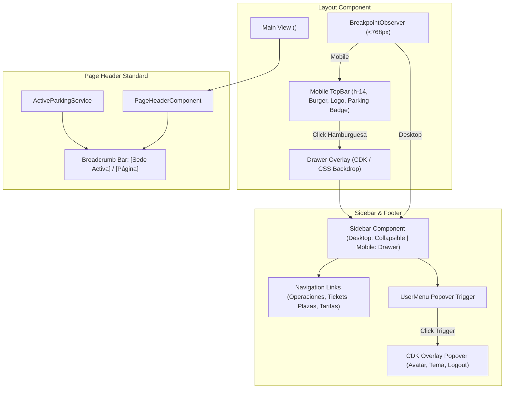

# Diseño Técnico: Modernización UI/UX del Sistema Nivo

## 1. Arquitectura y Componentes Afectados



---

## 2. Especificación de Componentes

### 2.1 Layout Responsivo y Mobile Drawer (`LayoutComponent`)
- **Archivo**: `apps/web/src/app/layouts/layout/layout-component/`
- **Responsabilidad**:
  - Detectar resolución de pantalla mediante `BreakpointObserver.observe([Breakpoints.XSmall, Breakpoints.Small])` (<768px).
  - Gestionar señales `isMobile` y `mobileDrawerOpen`.
  - En móviles:
    - Ocultar la sidebar fija `w-16` / `w-64`.
    - Renderizar barra superior móvil fija (`h-14 border-b border-border bg-card px-4`) con botón de apertura (`lucideMenu`), logo compacto y chip de parqueadero activo (`ActiveParkingService.activeParkingName()`).
    - Desplegar `app-sidebar` en un contenedor flotante (`fixed inset-0 z-50`) con backdrop (`bg-black/50 backdrop-blur-xs`) y transición fluida `translateX`.
    - Cerrar drawer al hacer click en el backdrop, pulsar tecla `Escape` o al detectar navegación completada (`NavigationEnd`).
  - En escritorio (>=768px):
    - Mantener la sidebar lateral colapsable normal sin barra superior duplicada.

### 2.2 User Menu Popover (`UserMenuComponent`)
- **Archivo**: `apps/web/src/app/shared/components/user-menu/`
- **Responsabilidad**:
  - Transformar el componente puramente informativo a un disparador interactivo (`role="button"`, `aria-haspopup="menu"`, `aria-expanded`).
  - Integrar `@angular/cdk/overlay` para renderizar un menú popover flotante anclado hacia arriba (`connectedTo` con posiciones `top-start` / `top-end`).
  - Contenido del Popover:
    - Encabezado: Avatar, nombre completo, email y rol (`nv-badge`).
    - Bloque de Apariencia: Switcher claro/oscuro que delega en el servicio de tema (`ThemeService` / `ThemeButton`).
    - Divisor: `nv-divider` o borde semántico.
    - Acción Destructiva: `app-logout-button` accesible.
  - Limpiar `SidebarFooter` eliminando los 3 botones sueltos apilados, manteniendo únicamente `<app-user-menu [collapsed]="collapsed()" />`.

### 2.3 `PageHeaderComponent` Estandarizado con Breadcrumbs Reactivos
- **Archivo**: `apps/web/src/app/shared/components/page-header/`
- **Responsabilidad**:
  - Añadir soporte de breadcrumbs:
    - Input opcional: `breadcrumbs = input<{ label: string; url?: string }[] | null>(null);`
    - Fallback computado reactivo:
      ```typescript
      protected readonly activeBreadcrumbs = computed(() => {
        const explicit = this.breadcrumbs();
        if (explicit && explicit.length > 0) return explicit;
        const parkingName = this.activeParkingService.activeParkingName();
        if (parkingName) {
          return [
            { label: parkingName, icon: 'lucideSquareParking' },
            { label: this.title() }
          ];
        }
        return [{ label: this.title() }];
      });
      ```
  - Proyección de contenido y variantes de badge preservadas.
  - Reemplazar encabezados manuales en:
    - `ParkingHome` (`@features/parking/page/parking-home/`)
    - `ParkingSlotsListPage` (`@features/slots/page/parking-slots-list/`)
    - `RateListComponent` (`@features/rates/components/rates-list/`)
    - Formularios de creación y edición (`parking-form`, `parking-slot-form`, `rate-form`).

---

## 3. Manejo de Errores y Casos Borde
1. **Sin parqueadero activo**: Si no hay sede activa en `ActiveParkingService`, el breadcrumb hace fallback automático al nombre del módulo o marca ("Nivo").
2. **Navegación mientras el drawer está abierto**: Se suscribe a `Router.events` (`NavigationEnd`) para cerrar automáticamente el drawer móvil evitando pantallas bloqueadas.
3. **Foco y Accesibilidad**: Al abrir el popover o drawer, el foco debe manejarse adecuadamente y soportar cierre con tecla `Escape`.
4. **`prefers-reduced-motion`**: Las animaciones de deslizamiento del drawer y fade-in del popover respetan las preferencias de reducción de movimiento del sistema.

---

## 4. Estrategia de Pruebas (Strict TDD)
- **`layout-component.spec.ts`**: Pruebas con mocks de `BreakpointObserver` para validar renderizado de barra móvil en <768px, apertura/cierre de drawer y auto-cierre en `NavigationEnd`.
- **`user-menu.spec.ts`**: Pruebas de interacción del popover con `@angular/cdk/overlay`, renderizado de tema y botón de cierre de sesión.
- **`sidebar-footer.spec.ts`**: Verificación del footer simplificado conteniendo el trigger del user menu.
- **`page-header.component.spec.ts`**: Pruebas unitarias de cómputo de breadcrumbs con y sin sede activa en `ActiveParkingService`, y con `breadcrumbs` explícitos.
