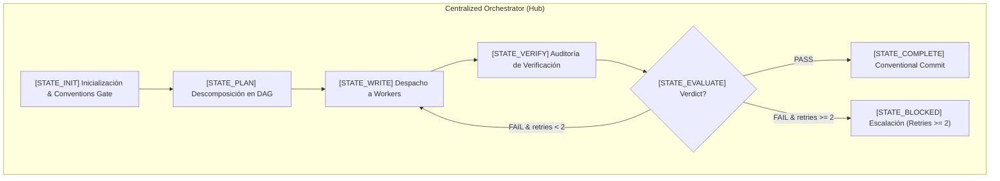
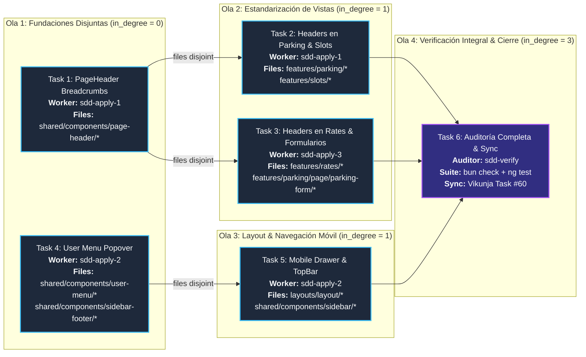

# Modernización UI/UX del Sistema Nivo - Plan de Implementación

> **For agentic workers:** REQUIRED SUB-SKILL: Use superpowers:subagent-driven-development (recommended) or superpowers:executing-plans to implement this plan task-by-task. Steps use checkbox (`- [ ]`) syntax for tracking.

**Goal:** Optimizar la experiencia de usuario y el responsive de la app web implementando un drawer lateral ocultable en móvil (<768px), un User Menu interactivo con popover CDK para perfil/tema/logout, y estandarizando `PageHeaderComponent` con migas de pan reactivas (`[Sede Activa] / [Módulo]`) en todas las vistas principales.

**Architecture:** Refactorización modular en Angular 21 y Tailwind CSS. El `LayoutComponent` gestiona la responsividad mediante `BreakpointObserver`, alternando entre sidebar fija en escritorio y drawer lateral con backdrop oscuro en móvil. `UserMenuComponent` utiliza CDK Overlay para desplegar hacia arriba las acciones de cuenta, tema y sesión. `PageHeaderComponent` se desacopla con un fallback reactivo que consulta `ActiveParkingService.activeParkingName()` y se propaga en `ParkingHome`, `ParkingSlotsListPage`, `RateListComponent` y formularios.

**Tech Stack:** Angular 21 (Signals, standalone components, control flow), `@angular/cdk` (Layout BreakpointObserver, Overlay), `@nivo-sass/design-system`, `@ng-icons/lucide`, Vitest / Angular CLI unit-test runner.

**Spec:** `.openspec/changes/2026-09-12-ui-ux-modernization/design.md`

## Global Constraints

- Cumplimiento estricto de `conventions.md` (Design System First con `@nivo-sass/design-system`, OnPush change detection, Signals reactivas).
- Todos los comandos CLI con prefijo `rtk` (RTK CLI proxy).
- Convención de commits: `feat(web):`, `refactor(web):`, `test(web):` según `AGENTS.md`.
- Límite de revisión: presupuesto máximo de 400 líneas por tarea / commit.
- TDD estricto: escribir prueba primero, verificar fallo (Red), implementar (Green) y refactorizar.
- Enrutamiento multi-agente centralizado (Hub-and-Spoke): el orquestador delega a subagentes de implementación (`sdd-apply`) y verificación (`sdd-verify`) con conjuntos de archivos disjuntos (`files(A) ∩ files(B) = ∅`).

---

## Graph Agent Execution Architecture (DAG & Routing)

### 1. Hub-and-Spoke Topology & Multi-Agent State Machine



### 2. Task Execution DAG (Directed Acyclic Graph)



### 3. Matriz de Concurrencia y Aislamiento de Archivos

| Tarea | Worker / Subagente | Archivos Afectados | Dependencias (`in_degree`) | Elegible para Paralelo |
| :--- | :--- | :--- | :--- | :--- |
| **Task 1** | `sdd-apply` (Worker 1) | `apps/web/src/app/shared/components/page-header/*` | Ninguna (`in_degree = 0`) | Sí (con Task 4) |
| **Task 4** | `sdd-apply` (Worker 2) | `apps/web/src/app/shared/components/user-menu/*`<br/>`apps/web/src/app/shared/components/sidebar-footer/*` | Ninguna (`in_degree = 0`) | Sí (con Task 1: `files(T1) ∩ files(T4) = ∅`) |
| **Task 2** | `sdd-apply` (Worker 1) | `apps/web/src/app/features/parking/page/parking-home/*`<br/>`apps/web/src/app/features/slots/*` | Requiere Task 1 | Sí (con Task 3: `files(T2) ∩ files(T3) = ∅`) |
| **Task 3** | `sdd-apply` (Worker 3) | `apps/web/src/app/features/rates/*`<br/>`apps/web/src/app/features/parking/page/parking-form/*` | Requiere Task 1 | Sí (con Task 2: `files(T2) ∩ files(T3) = ∅`) |
| **Task 5** | `sdd-apply` (Worker 2) | `apps/web/src/app/layouts/layout/*`<br/>`apps/web/src/app/shared/components/sidebar/*` | Requiere Task 4 | Secuencial tras Task 4 |
| **Task 6** | `sdd-verify` (Auditor) | Workspace completo (`apps/web/src/*`) | Requiere Tasks 2, 3, 5 | Punto de convergencia / auditoría final |

---

### Task 1: Breadcrumbs Reactivos en `PageHeaderComponent`

**Files:**
- Modify: `apps/web/src/app/shared/components/page-header/page-header.component.ts`
- Modify: `apps/web/src/app/shared/components/page-header/page-header.component.html`
- Test: `apps/web/src/app/shared/components/page-header/page-header.component.spec.ts`

**Interfaces:**
- Consumes: `ActiveParkingService.activeParkingName(): Signal<string>` desde `@core/services/active-parking.service`.
- Produces: `PageHeaderComponent` con input opcional `breadcrumbs = input<{ label: string; url?: string }[] | null>(null)` y señal computada `activeBreadcrumbs`.

- [ ] **Step 1: Escribir pruebas que fallen en `page-header.component.spec.ts`**

Agregar pruebas para validar:
1. Fallback reactivo que muestra `[Nombre Sede] / [title]` cuando existe parqueadero activo.
2. Fallback sin sede activa (solo `[title]`).
3. Renderizado de breadcrumbs explícitos pasados por input `[breadcrumbs]`.

```typescript
// En apps/web/src/app/shared/components/page-header/page-header.component.spec.ts
it('should render reactive breadcrumb with active parking lot name and title by default', () => {
  mockActiveParkingService.activeParkingName.set('Sede Central');
  fixture.detectChanges();

  const breadcrumbEl = fixture.nativeElement.querySelector('[data-testid="page-header-breadcrumb"]');
  expect(breadcrumbEl).toBeTruthy();
  expect(breadcrumbEl.textContent).toContain('Sede Central');
  expect(breadcrumbEl.textContent).toContain('Dashboard');
});

it('should render custom explicit breadcrumbs when provided', () => {
  fixture.componentRef.setInput('breadcrumbs', [
    { label: 'Parqueaderos', url: '/app/parking-lots' },
    { label: 'Detalle' },
  ]);
  fixture.detectChanges();

  const breadcrumbEl = fixture.nativeElement.querySelector('[data-testid="page-header-breadcrumb"]');
  expect(breadcrumbEl.textContent).toContain('Parqueaderos');
  expect(breadcrumbEl.textContent).toContain('Detalle');
});
```

- [ ] **Step 2: Ejecutar prueba para verificar que falla**

Run: `rtk bun --cwd apps/web ng test --watch=false --include=src/app/shared/components/page-header/page-header.component.spec.ts`
Expected: FAIL con `page-header-breadcrumb not found` o `mockActiveParkingService not injected`.

- [ ] **Step 3: Implementar soporte de breadcrumbs en `PageHeaderComponent`**

En `page-header.component.ts`:
- Inyectar `ActiveParkingService` (opcional o default con mock seguro).
- Declarar `readonly breadcrumbs = input<{ label: string; url?: string }[] | null>(null);`
- Computar `readonly computedBreadcrumbs = computed(...)` que devuelva `breadcrumbs()` si existe o componga con `activeParkingName()` y `title()`.

En `page-header.component.html`:
- Añadir sección superior de navegación de migas antes del row del título:
```html
@if (computedBreadcrumbs().length > 0) {
  <nav aria-label="Ruta de navegación" data-testid="page-header-breadcrumb" class="flex items-center gap-1.5 text-xs text-muted-foreground font-mono">
    @for (item of computedBreadcrumbs(); track $index) {
      @if ($index > 0) {
        <span class="text-border">/</span>
      }
      @if (item.url) {
        <a [routerLink]="item.url" class="hover:text-foreground transition-colors">{{ item.label }}</a>
      } @else {
        <span [class.text-foreground]="$last" [class.font-semibold]="$last">{{ item.label }}</span>
      }
    }
  </nav>
}
```

- [ ] **Step 4: Ejecutar pruebas para verificar que pasan**

Run: `rtk bun --cwd apps/web ng test --watch=false --include=src/app/shared/components/page-header/page-header.component.spec.ts`
Expected: PASS (todos los tests pasando).

- [ ] **Step 5: Commit**

```bash
rtk git add apps/web/src/app/shared/components/page-header/
rtk git commit -m "feat(web): add reactive and explicit breadcrumbs to PageHeaderComponent"
```

---

### Task 2: Estandarizar `PageHeaderComponent` en Vistas Operativas (Parking & Slots)

**Files:**
- Modify: `apps/web/src/app/features/parking/page/parking-home/parking-home.html`
- Modify: `apps/web/src/app/features/parking/page/parking-home/parking-home.ts`
- Modify: `apps/web/src/app/features/slots/page/parking-slots-list/parking-slots-list.html`
- Modify: `apps/web/src/app/features/slots/page/parking-slots-list/parking-slots-list.ts`
- Test: `apps/web/src/app/features/parking/page/parking-home/parking-home.spec.ts`
- Test: `apps/web/src/app/features/slots/page/parking-slots-list/parking-slots-list.spec.ts`

**Interfaces:**
- Consumes: `<app-page-header>` importado en `imports: [PageHeaderComponent]`.
- Produces: Vistas `ParkingHome` y `ParkingSlotsListPage` con encabezado normalizado.

- [ ] **Step 1: Escribir/actualizar pruebas unitarias en `parking-home.spec.ts` y `parking-slots-list.spec.ts`**

Verificar que ambos componentes rendericen `app-page-header` con el título y las acciones proyectadas (`[actions]`).

- [ ] **Step 2: Ejecutar pruebas y verificar fallo si no usan `app-page-header`**

Run: `rtk bun --cwd apps/web ng test --watch=false --include=src/app/features/parking/page/parking-home/parking-home.spec.ts`
Expected: FAIL si buscaba encabezados `h1` manuales o falta el componente.

- [ ] **Step 3: Reemplazar encabezados manuales por `app-page-header`**

En `parking-home.html` y `parking-slots-list.html`:
- Sustituir la cabecera manual por:
```html
<app-page-header title="Parqueadero" [subtitle]="activeParkingSubtitle()">
  <div actions class="flex items-center gap-2">
    <!-- Acciones específicas de la vista -->
  </div>
</app-page-header>
```

- [ ] **Step 4: Ejecutar pruebas para verificar que pasan**

Run: `rtk bun --cwd apps/web ng test --watch=false --include=src/app/features/parking/page/parking-home/parking-home.spec.ts`
Run: `rtk bun --cwd apps/web ng test --watch=false --include=src/app/features/slots/page/parking-slots-list/parking-slots-list.spec.ts`
Expected: PASS.

- [ ] **Step 5: Commit**

```bash
rtk git add apps/web/src/app/features/parking/ apps/web/src/app/features/slots/
rtk git commit -m "feat(web): standardize page headers in parking home and slots list"
```

---

### Task 3: Estandarizar `PageHeaderComponent` en Tarifas y Formularios

**Files:**
- Modify: `apps/web/src/app/features/rates/components/rates-list/rates-list.html`
- Modify: `apps/web/src/app/features/rates/components/rates-list/rates-list.ts`
- Modify: `apps/web/src/app/features/parking/page/parking-form/parking-form.html`
- Modify: `apps/web/src/app/features/parking/page/parking-form/parking-form.ts`
- Test: `apps/web/src/app/features/rates/components/rates-list/rates-list.spec.ts`
- Test: `apps/web/src/app/features/parking/page/parking-form/parking-form.spec.ts`

**Interfaces:**
- Consumes: `<app-page-header [backLink]="..." [breadcrumbs]="...">`.
- Produces: Encabezados homogéneos en gestión de tarifas y formularios de creación/edición.

- [ ] **Step 1: Escribir/actualizar pruebas en `rates-list.spec.ts` y `parking-form.spec.ts`**

Verificar presencia de `app-page-header` con soporte de `backLink` en formularios.

- [ ] **Step 2: Ejecutar pruebas y verificar fallo**

Run: `rtk bun --cwd apps/web ng test --watch=false --include=src/app/features/rates/components/rates-list/rates-list.spec.ts`

- [ ] **Step 3: Implementar `app-page-header` en tarifas y formularios**

Integrar `PageHeaderComponent` proyectando botones de crear/editar tarifa y botón de volver (`backLink`) en formularios.

- [ ] **Step 4: Ejecutar pruebas y verificar que pasan**

Run: `rtk bun --cwd apps/web ng test --watch=false --include=src/app/features/rates/components/rates-list/rates-list.spec.ts`
Run: `rtk bun --cwd apps/web ng test --watch=false --include=src/app/features/parking/page/parking-form/parking-form.spec.ts`
Expected: PASS.

- [ ] **Step 5: Commit**

```bash
rtk git add apps/web/src/app/features/rates/ apps/web/src/app/features/parking/
rtk git commit -m "feat(web): standardize page headers in rates list and parking forms"
```

---

### Task 4: User Menu Popover con Tema y Cierre de Sesión

**Files:**
- Modify: `apps/web/src/app/shared/components/user-menu/user-menu.ts`
- Modify: `apps/web/src/app/shared/components/user-menu/user-menu.html`
- Modify: `apps/web/src/app/shared/components/user-menu/user-menu.css`
- Modify: `apps/web/src/app/shared/components/sidebar-footer/sidebar-footer.html`
- Modify: `apps/web/src/app/shared/components/sidebar-footer/sidebar-footer.ts`
- Test: `apps/web/src/app/shared/components/user-menu/user-menu.spec.ts`
- Test: `apps/web/src/app/shared/components/sidebar-footer/sidebar-footer.spec.ts`

**Interfaces:**
- Consumes: `@angular/cdk/overlay`, `AuthService` (logout, user), `ThemeButton`, `LogoutButton`.
- Produces: `UserMenu` como trigger interactivo con popover flotante hacia arriba (`connectedTo`).

- [ ] **Step 1: Escribir pruebas unitarias en `user-menu.spec.ts`**

Verificar:
1. El trigger tiene atributos de accesibilidad (`role="button"`, `aria-haspopup="menu"`, `aria-expanded`).
2. Al hacer click en el trigger, el popover se abre.
3. El popover contiene selector de tema y botón de cerrar sesión.
4. Al hacer click fuera o presionar `Escape`, el popover se cierra.

- [ ] **Step 2: Ejecutar pruebas para verificar que fallan**

Run: `rtk bun --cwd apps/web ng test --watch=false --include=src/app/shared/components/user-menu/user-menu.spec.ts`
Expected: FAIL con `aria-haspopup` o `popover` no encontrados.

- [ ] **Step 3: Implementar Popover con CDK Overlay en `UserMenu`**

En `user-menu.ts` y `user-menu.html`:
- Convertir la tarjeta en un `<button>` con clases de diseño de Nivo.
- Conectar directiva `cdkOverlayOrigin` y plantilla `ng-template cdkConnectedOverlay` configurada con anclaje hacia arriba (`top-start`, `top-end`).
- Integrar dentro del overlay: datos de usuario, `<app-theme-button />` y `<app-logout-button />`.
- En `sidebar-footer.html`: remover `<app-theme-button>` y `<app-logout-button>` sueltos, dejando únicamente `<app-user-menu [collapsed]="collapsed()" />`.

- [ ] **Step 4: Ejecutar pruebas de `user-menu` y `sidebar-footer`**

Run: `rtk bun --cwd apps/web ng test --watch=false --include=src/app/shared/components/user-menu/user-menu.spec.ts`
Run: `rtk bun --cwd apps/web ng test --watch=false --include=src/app/shared/components/sidebar-footer/sidebar-footer.spec.ts`
Expected: PASS.

- [ ] **Step 5: Commit**

```bash
rtk git add apps/web/src/app/shared/components/user-menu/ apps/web/src/app/shared/components/sidebar-footer/
rtk git commit -m "feat(web): implement interactive user menu popover with theme and logout"
```

---

### Task 5: Layout Responsivo y Mobile Drawer

**Files:**
- Modify: `apps/web/src/app/layouts/layout/layout-component/layout-component.ts`
- Modify: `apps/web/src/app/layouts/layout/layout-component/layout-component.html`
- Modify: `apps/web/src/app/layouts/layout/layout-component/layout-component.css`
- Modify: `apps/web/src/app/shared/components/sidebar/sidebar/sidebar.ts`
- Modify: `apps/web/src/app/shared/components/sidebar/sidebar/sidebar.html`
- Test: `apps/web/src/app/layouts/layout/layout-component/layout-component.spec.ts`

**Interfaces:**
- Consumes: `BreakpointObserver` (`Breakpoints.Small`, `Breakpoints.XSmall`), `Router.events` (`NavigationEnd`).
- Produces: Barra superior móvil fija con trigger hamburguesa y Sidebar en Drawer deslizante con backdrop.

- [ ] **Step 1: Escribir pruebas unitarias en `layout-component.spec.ts`**

Verificar:
1. Cuando breakpoint es móvil (<768px), se renderiza la barra superior móvil con el botón hamburguesa.
2. Al hacer click en el botón hamburguesa, el drawer se abre (`mobileDrawerOpen` es true) y se muestra el backdrop.
3. Al hacer click en el backdrop o disparar `NavigationEnd`, el drawer se cierra.
4. En escritorio (>=768px), la barra superior móvil no se renderiza y la sidebar permanece en el layout base.

- [ ] **Step 2: Ejecutar pruebas para verificar que fallan**

Run: `rtk bun --cwd apps/web ng test --watch=false --include=src/app/layouts/layout/layout-component/layout-component.spec.ts`
Expected: FAIL con elementos de topbar móvil o drawer no encontrados.

- [ ] **Step 3: Implementar TopBar móvil y Drawer en `LayoutComponent`**

En `layout-component.ts`:
- Inyectar `BreakpointObserver`, `ActiveParkingService`, `Router`.
- Señal `isMobile = toSignal(...)`.
- Señal `mobileDrawerOpen = signal(false)`.
- Escuchar `NavigationEnd` para cerrar el drawer.

En `layout-component.html`:
- Barra superior móvil (`@if (isMobile())`) con logo Nivo, sede activa y botón hamburguesa.
- Drawer móvil flotante con backdrop oscuro `@if (isMobile() && mobileDrawerOpen())` conteniendo `<router-outlet name="sidebar" />`.
- En desktop, renderizado directo de `<router-outlet name="sidebar" />`.

- [ ] **Step 4: Ejecutar pruebas para verificar que pasan**

Run: `rtk bun --cwd apps/web ng test --watch=false --include=src/app/layouts/layout/layout-component/layout-component.spec.ts`
Expected: PASS.

- [ ] **Step 5: Commit**

```bash
rtk git add apps/web/src/app/layouts/layout/layout-component/ apps/web/src/app/shared/components/sidebar/
rtk git commit -m "feat(web): implement responsive mobile layout with drawer navigation"
```

---

### Task 6: Verificación Integral de la Suite y Cierre de Tarea

**Files:**
- All modified files in `apps/web/src/`

- [ ] **Step 1: Ejecutar verificación completa de tipos y linting**

Run: `rtk bun --cwd apps/web check`
Expected: 0 errores de tipo y lint.

- [ ] **Step 2: Ejecutar suite completa de pruebas unitarias de frontend**

Run: `rtk bun --cwd apps/web ng test --watch=false`
Expected: 100% de pruebas pasando sin regresiones.

- [ ] **Step 3: Sincronizar y actualizar estado en Vikunja**

Actualizar el checklist de la tarea #60 en Vikunja reflejando todas las fases completadas.

- [ ] **Step 4: Commit final**

```bash
rtk git add .
rtk git commit -m "chore(web): finalize UI/UX modernization and update verification report"
```
