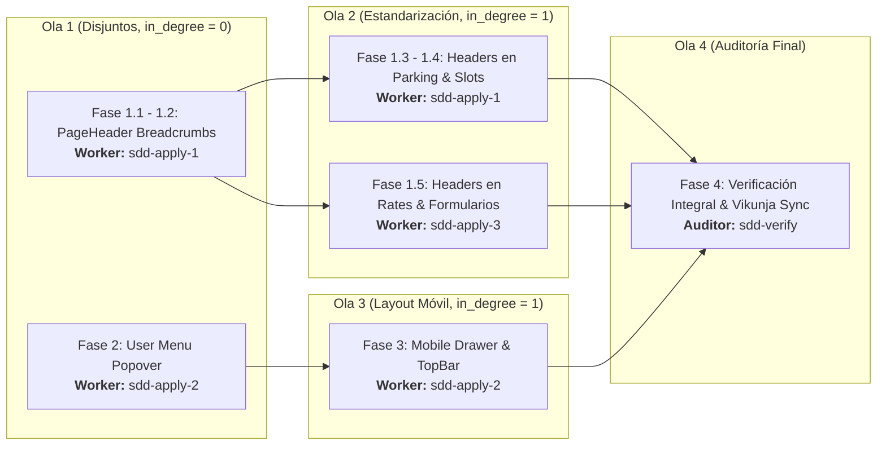

# Tareas de Implementación: Modernización UI/UX

## Execution DAG & Agent Routing

## Fase 1: PageHeader Estandarizado con Breadcrumbs Reactivos
- [ ] 1.1 Escribir pruebas unitarias en `page-header.component.spec.ts` para breadcrumbs automáticos (con/sin parqueadero activo) e inputs explícitos.
- [ ] 1.2 Implementar soporte de breadcrumbs y maquetación visual en `PageHeaderComponent` (`page-header.component.ts`, `page-header.component.html`).
- [ ] 1.3 Migrar encabezados manuales a `app-page-header` en `ParkingHome` y `parking-home-mobile`.
- [ ] 1.4 Migrar encabezados manuales a `app-page-header` en `ParkingSlotsListPage` y formularios de slots.
- [ ] 1.5 Migrar encabezados manuales a `app-page-header` en `RateListComponent` y formularios de tarifas.

## Fase 2: User Menu Popover (Tema + Logout)
- [ ] 2.1 Escribir pruebas unitarias en `user-menu.spec.ts` cubriendo comportamiento accesible de trigger y apertura/cierre de popover CDK.
- [ ] 2.2 Refactorizar `UserMenuComponent` para integrar trigger interactivo y menú flotante hacia arriba con perfil, `ThemeButton` y `LogoutButton`.
- [ ] 2.3 Actualizar `SidebarFooter` y sus pruebas (`sidebar-footer.spec.ts`) para alojar de forma limpia únicamente el `UserMenuComponent`.

## Fase 3: Layout Responsivo y Mobile Drawer
- [ ] 3.1 Escribir pruebas unitarias en `layout-component.spec.ts` verificando detección móvil, renderizado de top bar móvil, estado del drawer y auto-cierre con `NavigationEnd`.
- [ ] 3.2 Implementar la barra superior móvil, botón de menú hamburguesa, backdrop y contenedor Drawer en `LayoutComponent` (`layout-component.ts`, `layout-component.html`).
- [ ] 3.3 Ajustar estilos y transiciones de la `Sidebar` para comportarse fluidamente como drawer en móvil y barra lateral fija en escritorio.

## Fase 4: Verificación Integral y Documentación
- [ ] 4.1 Ejecutar suite completa de pruebas unitarias (`bun test` / `ng test`) asegurando 100% de tests pasando y cero regresiones.
- [ ] 4.2 Sincronizar estado final en Vikunja (marcar ítems completados en tarea #60).
