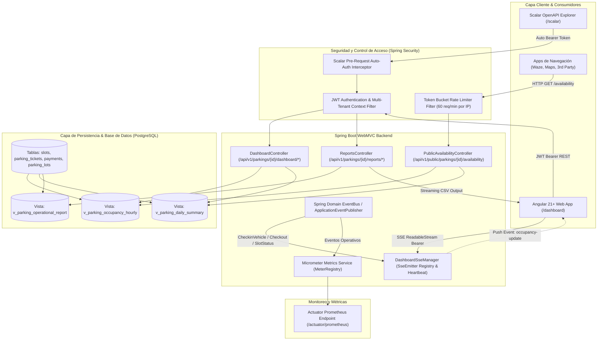

# Diseño Técnico: Dashboard Analítico, Métricas en Tiempo Real y API Pública de Disponibilidad

## 1. Arquitectura General y Diagrama de Componentes

La arquitectura de `feat-nivo-dashboard` integra capacidades analíticas de baja latencia y telemetría reactiva en el backend Spring Boot WebMVC, complementadas por una interfaz analítica en Angular 21+ impulsada por Signals y un canal público protegido por limitación de tasa (rate limiting).



---

## 2. Vistas en PostgreSQL (Modelado de Datos Analítico)

Para garantizar latencias de respuesta inferiores a 200ms en el endpoint público y 500ms en consultas agregadas del dashboard, se introducen tres vistas optimizadas en la migración Flyway `V5__create_dashboard_views_and_analytics.sql`:

### 2.1 `v_parking_occupancy_hourly`

Calcula la serie temporal horaria de entradas, salidas y ocupación pico por parqueadero y tramo horario:

```sql
CREATE OR REPLACE VIEW nivo.v_parking_occupancy_hourly AS
WITH hourly_buckets AS (
    SELECT
        t.tenant_id,
        s.parking_lot_id,
        date_trunc('hour', t.entry_time) AS hour_bucket,
        COUNT(t.id) AS checkin_count,
        COUNT(t.id) FILTER (WHERE t.exit_time IS NOT NULL AND date_trunc('hour', t.exit_time) = date_trunc('hour', t.entry_time)) AS checkout_same_hour,
        AVG(CASE WHEN t.status = 'OPEN' THEN 1.0 ELSE 0.0 END) AS active_ratio
    FROM nivo.parking_tickets t
    JOIN nivo.slots s ON s.id = t.slot_id
    WHERE t.deleted_at IS NULL
    GROUP BY t.tenant_id, s.parking_lot_id, date_trunc('hour', t.entry_time)
),
hourly_exits AS (
    SELECT
        t.tenant_id,
        s.parking_lot_id,
        date_trunc('hour', t.exit_time) AS hour_bucket,
        COUNT(t.id) AS checkout_count
    FROM nivo.parking_tickets t
    JOIN nivo.slots s ON s.id = t.slot_id
    WHERE t.exit_time IS NOT NULL AND t.deleted_at IS NULL
    GROUP BY t.tenant_id, s.parking_lot_id, date_trunc('hour', t.exit_time)
),
slot_capacities AS (
    SELECT
        parking_lot_id,
        COUNT(id) AS total_slots
    FROM nivo.slots
    WHERE deleted_at IS NULL AND status != 'MAINTENANCE'
    GROUP BY parking_lot_id
)
SELECT
    COALESCE(b.tenant_id, e.tenant_id) AS tenant_id,
    COALESCE(b.parking_lot_id, e.parking_lot_id) AS parking_lot_id,
    COALESCE(b.hour_bucket, e.hour_bucket) AS hour_bucket,
    COALESCE(b.checkin_count, 0) AS checkins,
    COALESCE(e.checkout_count, 0) AS checkouts,
    cap.total_slots AS total_capacity,
    ROUND(
        LEAST(100.0, GREATEST(0.0,
            (COALESCE(b.checkin_count, 0) * 100.0) / NULLIF(cap.total_slots, 0)
        )), 2
    ) AS estimated_occupancy_rate
FROM hourly_buckets b
FULL OUTER JOIN hourly_exits e
    ON b.parking_lot_id = e.parking_lot_id AND b.hour_bucket = e.hour_bucket
JOIN slot_capacities cap
    ON cap.parking_lot_id = COALESCE(b.parking_lot_id, e.parking_lot_id);
```

### 2.2 `v_parking_daily_summary`

Proporciona KPIs consolidados diarios de volumen vehicular, facturación total recaudada, tiempo promedio de estadía y rotación por sede:

```sql
CREATE OR REPLACE VIEW nivo.v_parking_daily_summary AS
SELECT
    s.parking_lot_id,
    p.tenant_id,
    date_trunc('day', t.entry_time)::date AS summary_date,
    COUNT(t.id) AS total_tickets,
    COUNT(t.id) FILTER (WHERE t.status = 'CLOSED') AS completed_tickets,
    COUNT(t.id) FILTER (WHERE t.status = 'OPEN') AS ongoing_tickets,
    COUNT(DISTINCT t.license_plate) AS unique_vehicles,
    COALESCE(SUM(pay.amount) FILTER (WHERE pay.status = 'PAID'), 0.00) AS total_revenue,
    ROUND(AVG(EXTRACT(EPOCH FROM (t.exit_time - t.entry_time)) / 60.0) FILTER (WHERE t.status = 'CLOSED'), 2) AS avg_duration_minutes,
    p.currency
FROM nivo.parking_tickets t
JOIN nivo.slots s ON s.id = t.slot_id
JOIN nivo.parking_lots p ON p.id = s.parking_lot_id
LEFT JOIN nivo.payments pay ON pay.parking_ticket_id = t.id AND pay.deleted_at IS NULL
WHERE t.deleted_at IS NULL
GROUP BY s.parking_lot_id, p.tenant_id, date_trunc('day', t.entry_time)::date, p.currency;
```

### 2.3 `v_parking_operational_report`

Vista desnormalizada preparada para listado paginado en tablas web y descarga continua por streaming CSV:

```sql
CREATE OR REPLACE VIEW nivo.v_parking_operational_report AS
SELECT
    t.id AS ticket_id,
    t.tenant_id,
    p.id AS parking_lot_id,
    p.name AS parking_name,
    t.license_plate,
    s.slot_number,
    s.zone AS slot_zone,
    s.prefix AS slot_prefix,
    s.type AS slot_type,
    r.name AS rate_name,
    t.entry_time,
    t.exit_time,
    ROUND(EXTRACT(EPOCH FROM (COALESCE(t.exit_time, CURRENT_TIMESTAMP) - t.entry_time)) / 60.0, 1) AS duration_minutes,
    t.status AS ticket_status,
    t.total_to_charge,
    pay.id AS payment_id,
    pay.status AS payment_status,
    pay.payment_method,
    pay.amount AS paid_amount,
    pay.completed_at AS payment_date,
    u.full_name AS operator_or_user_name,
    u.email AS user_email
FROM nivo.parking_tickets t
JOIN nivo.slots s ON s.id = t.slot_id
JOIN nivo.parking_lots p ON p.id = s.parking_lot_id
JOIN nivo.rates r ON r.id = t.rate_id
LEFT JOIN nivo.payments pay ON pay.parking_ticket_id = t.id AND pay.deleted_at IS NULL
LEFT JOIN nivo.users u ON u.id = t.user_id
WHERE t.deleted_at IS NULL;
```

---

## 3. Instrumentación de Métricas con Micrometer (`MeterRegistry`)

Se configuran métricas personalizadas en el espacio de nombres `parking.*` accesibles vía `/actuator/prometheus`:

### 3.1 Catálogo de Métricas

| Métrica                                | Tipo            | Etiquetas (Tags)                      | Descripción                                       |
| :------------------------------------- | :-------------- | :------------------------------------ | :------------------------------------------------ |
| `parking.occupancy.rate`               | Gauge           | `parkingId`, `tenantId`               | Porcentaje actual de ocupación (0.00% a 100.00%). |
| `parking.slots.total`                  | Gauge           | `parkingId`, `tenantId`               | Capacidad total de plazas activas.                |
| `parking.slots.occupied`               | Gauge           | `parkingId`, `tenantId`               | Número de plazas ocupadas o reservadas.           |
| `parking.slots.available`              | Gauge           | `parkingId`, `tenantId`               | Número de plazas libres de inmediato.             |
| `parking.tickets.active`               | Gauge           | `parkingId`, `tenantId`               | Cantidad de tickets en estado `OPEN`.             |
| `parking.revenue.daily`                | Counter / Gauge | `parkingId`, `tenantId`, `currency`   | Ingresos acumulados en la jornada actual.         |
| `parking.checkin.total`                | Counter         | `parkingId`, `vehicleType`            | Contador de ingresos vehiculares registrados.     |
| `parking.checkout.total`               | Counter         | `parkingId`, `vehicleType`            | Contador de egresos vehiculares procesados.       |
| `parking.public.availability.requests` | Counter         | `parkingId`, `status` (200, 429, 404) | Tráfico hacia la API pública de disponibilidad.   |

### 3.2 Arquitectura del Servicio de Métricas

- **Clase**: `dev.angelcorzo.nivo.infrastructure.adapter.metrics.ParkingMetricsManager`
- Mantiene referencias seguras a `AtomicDouble` y contadores registrados dinámicamente en `MeterRegistry`.
- Se suscribe a los eventos del dominio para refrescar los medidores sin bloquear las transacciones HTTP del check-in o check-out.

---

## 4. Endpoints REST WebMVC y Streaming SSE Reactivo

### 4.1 Endpoints REST del Dashboard

1. `GET /api/v1/parkings/{parkingId}/dashboard/summary`
   - Retorna resumen en tiempo real: ocupación actual, desglose por tipo de vehículo, ingresos del día, comparación porcentual frente al día anterior y tiempo medio de permanencia.
2. `GET /api/v1/parkings/{parkingId}/dashboard/occupancy-hourly?startDate={iso}&endDate={iso}`
   - Consulta `v_parking_occupancy_hourly` retornando la curva cronológica de ocupación y volumen de tráfico para gráficos de área y líneas.
3. `GET /api/v1/parkings/{parkingId}/reports/operational?startDate={iso}&endDate={iso}&page=0&size=20&search={plate}`
   - Retorna página paginada de registros operativos (`v_parking_operational_report`).
4. `GET /api/v1/parkings/{parkingId}/reports/operational/csv?startDate={iso}&endDate={iso}`
   - Produce `text/csv` con `Content-Disposition: attachment; filename="operational-report-{parkingId}-{date}.csv"`.
   - Utiliza escritura en streaming directo al `OutputStream` del `HttpServletResponse` mediante chunks amortiguados para soportar exportaciones masivas con consumo constante de memoria O(1).

### 4.2 Stream SSE Reactivo (`/api/v1/parkings/{parkingId}/dashboard/stream`)

- **Controlador**: `DashboardStreamController`
- **Manejador de Conexiones**: `DashboardSseRegistry`
  - Utiliza `ConcurrentHashMap<UUID, CopyOnWriteArrayList<SseEmitter>>` mapeado por `parkingId`.
  - Configuración de timeout: 30 minutos con reconexión automática del cliente.
  - Tarea periódica de Heartbeat cada 15 segundos (`event: ping`) para evitar cierres prematuros por firewalls, proxies o balanceadores de carga.
  - Handlers de ciclo de vida:
    - `emitter.onCompletion(() -> removeEmitter(parkingId, emitter))`
    - `emitter.onTimeout(() -> removeEmitter(parkingId, emitter))`
    - `emitter.onError((e) -> removeEmitter(parkingId, emitter))`
- **Eventos Emitidos**:
  - `event: snapshot`: Payload inicial completo con resumen y ocupación actual nada más conectar.
  - `event: occupancy-update`: Notificación diferencial ante cambios en ocupación (activado por listener de `TicketCheckedInEvent` o `TicketCheckedOutEvent`).
  - `event: revenue-update`: Notificación de recaudación ante evento `PaymentCompletedEvent`.

---

## 5. API Pública de Disponibilidad con Rate Limiting por Token Bucket

### 5.1 Especificación del Endpoint

- **URL**: `GET /api/v1/public/parkings/{parkingId}/availability`
- **Autenticación**: Pública (permitida en `SecurityChain`).
- **Respuesta JSON (200 OK)**:

```json
{
  "parkingId": "c8b3687c-3f95-4424-9b5d-9c3f4e1762aa",
  "name": "Nivo Central Mall",
  "timestamp": "2026-09-24T21:40:00Z",
  "totalSlots": 150,
  "availableSlots": 42,
  "occupiedSlots": 108,
  "occupancyRate": 72.0,
  "slotDistribution": [
    { "type": "CAR", "total": 100, "available": 24, "occupied": 76 },
    { "type": "MOTORCYCLE", "total": 40, "available": 15, "occupied": 25 },
    { "type": "EV", "total": 10, "available": 3, "occupied": 7 }
  ]
}
```

### 5.2 Token Bucket Rate Limiting (60 req/min por IP)

- **Implementación**: Filtro WebMVC `PublicApiRateLimitFilter` utilizando el algoritmo Token Bucket en memoria (o Bucket4j) indexado por IP cliente (analizando cabeceras `X-Forwarded-For` y `RemoteAddr`).
- **Parámetros**:
  - Capacidad máxima del bucket: 60 tokens.
  - Tasa de reabastecimiento: 60 tokens por minuto (1 token por segundo).
- **Cabeceras HTTP en la Respuesta**:
  - `X-RateLimit-Limit: 60`
  - `X-RateLimit-Remaining: 34`
  - `X-RateLimit-Reset: 1727218860`
- **Caso Exceso de Tasa**:
  - Código: `HTTP 429 Too Many Requests`
  - Cabecera: `Retry-After: 26`
  - Body:

    ```json
    {
      "status": 429,
      "error": "Too Many Requests",
      "message": "Has excedido el límite de 60 peticiones por minuto. Intenta nuevamente en 26 segundos."
    }
    ```

- **Caché de Corta Duración**:
  - Cache en memoria (Caffeine) con TTL de 30 segundos para evitar saturación de la base de datos ante ráfagas concurrentes.
  - Cabecera de respuesta: `Cache-Control: public, max-age=30`.

---

## 6. Scalar Pre-Request Auto-Authentication

### 6.1 Problema

En la interfaz de documentación interactiva de Scalar (`/scalar`), los desarrolladores deben autenticarse continuamente mediante `POST /api/v1/auth/login`, copiar manualmente el token JWT y pegarlo en el cuadro modal de autorización Bearer.

### 6.2 Solución Arquitectónica

1. **Extensión OpenAPI**:
   Se enriquece la definición de OpenAPI mediante la configuración de SpringDoc / SwaggerConfiguration inyectando metadatos de extensión pre-request reconocidos por Scalar (`x-scalar-pre-request` o scripting de inicialización).
2. **Script de Inyección de Credenciales y Token**:
   - Scalar se sirve con una plantilla personalizada (`ScalarCustomWebMvcConfigurer` o script hook) que ejecuta un hook `onBeforeRequest`.
   - Verifica si existe un Bearer token válido en el almacenamiento de sesión/local. Si no existe o expira, realiza una llamada asíncrona de fondo a `/api/v1/auth/login` con credenciales de prueba preconfiguradas (`demo@nivo.dev` / contraseña del entorno de desarrollo).
   - Extrae el token JWT devuelto (`accessToken`) y lo asigna en la cabecera `Authorization: Bearer <token>` de forma transparente para todas las peticiones interactivas lanzadas desde Scalar.
   - Proporciona un control en la UI para forzar renovación o invalidar la sesión interactiva.

---

## 7. Arquitectura Frontend en Angular 21+ (`apps/web`)

### 7.1 `DashboardFacade` (Gestión Reactiva con Signals)

- **Ubicación**: `apps/web/src/app/features/dashboard/facade/dashboard.facade.ts`
- **Estado Reactivo**:

  ```typescript
  export class DashboardFacade {
    readonly summary = signal<DashboardSummary | null>(null);
    readonly occupancyHourly = signal<HourlyOccupancyPoint[]>([]);
    readonly reports = signal<OperationalReportItem[]>([]);
    readonly totalReports = signal<number>(0);
    readonly isStreaming = signal<boolean>(false);
    readonly isExportingCsv = signal<boolean>(false);
    readonly dateRange = signal<{ startDate: string; endDate: string }>({
      startDate: defaultStartDate(),
      endDate: defaultEndDate(),
    });

    // Cómputos reactivos
    readonly occupancyPercentage = computed(
      () => this.summary()?.occupancyRate ?? 0,
    );
    readonly isCapacityAlert = computed(() => this.occupancyPercentage() >= 90);
  }
  ```

- **Consumo SSE con `fetch` y `ReadableStream`**:
  Dado que el API SSE requiere cabecera `Authorization: Bearer <token>`, el navegador nativo `EventSource` es insuficiente. La fachada implementa conexión vía:

  ```typescript
  async connectStream(parkingId: string): Promise<void> {
    const token = this.authService.getAccessToken();
    const response = await fetch(`/api/v1/parkings/${parkingId}/dashboard/stream`, {
      headers: { Authorization: `Bearer ${token}` }
    });
    const reader = response.body?.getReader();
    // Decodificación de chunks de eventos SSE, parseo de JSON y actualización de signals
  }
  ```

  Soporta reconexión automática exponencial ante desconexiones accidentales.

### 7.2 Componentes de Visualización con Chart.js

- Se instala `chart.js` (`^4.4.x`) respetando los estilos globales de Tailwind CSS v4 y el diseño del sistema.
- **`OccupancyTrendChartComponent`**:
  - Curva de ocupación horaria con `tension: 0.4` (spline suave).
  - Relleno vertical degradado (LinearGradient de CSS/Canvas de verde/azul semántico a transparente).
  - Línea guía de capacidad máxima punteada (`borderDash: [5, 5]`).
  - Tooltips accesibles formateados con hora local y tasa de ocupación.
- **`SlotDistributionDonutChartComponent`**:
  - Gráfico de dona que muestra la distribución de plazas ocupadas, disponibles y reservadas, o por tipo (autos, motos, eléctricos).
  - Centro hueco con indicador de texto grande (`nv-typography`) con el porcentaje general.
- **Componentes OnPush**: Todos los componentes de gráficos son puramente presentacionales, reciben datos vía `input()` y se destruyen limpiamente en `ngOnDestroy` (`chart.destroy()`).

### 7.3 Reportes Operativos con TanStack Table

- **Ubicación**: `apps/web/src/app/features/dashboard/components/operational-reports-table/`
- Se utiliza `@tanstack/angular-table` siguiendo las reglas estrictas de `conventions.md`:
  - **Prohibido**: Escaleras de `@if / @else if (column.id === ...)` en el template HTML.
  - **Obligatorio**: Definir cabeceras y renderizado de celdas en la propia definición de columnas (`columnHelper`), utilizando `flexRenderComponent` para chips de estado (`nv-badge`), fechas formateadas y acciones.
  - Template minimalista y puramente declarativo con directiva `*flexRender`.
- Selector de rango de fechas reactivo integrado con los inputs del diseño del sistema (`nv-input[type="date"]`, `nv-button`).

### 7.4 Exportación Continua por Streaming CSV

- La interfaz ofrece un botón de descarga (`nv-button` con icono de descarga) conectado a `DashboardFacade.exportOperationalCsv()`.
- Descarga el reporte sin congelar la interfaz ni agotar memoria en el navegador, mediante stream de descarga y trigger de guardado directo en archivo Blob.
- Muestra notificación toast reactiva con `@ngxpert/hot-toast`.

### 7.5 Mandato del Sistema de Diseño (`@nivo-sass/design-system`)

- **Regla Estricta**: No utilizar elementos HTML crudos `<button>` o `<input>`. Se utilizan exclusivamente:
  - `nv-card`, `nv-card-header`, `nv-card-content`, `nv-card-title`, `nv-card-description`
  - `nv-button` (con variantes `primary`, `secondary`, `outline`, `destructive`)
  - `nv-badge` (para estados `AVAILABLE`, `OCCUPIED`, `PAID`, `OPEN`, `CLOSED`)
  - `nv-typography`
  - `nv-loader` / skeleton loaders para estados de carga
  - `nv-divider`

---

## 8. Casos Borde y Manejo de Errores

1. **Parqueadero sin actividad previa**:
   - Si no existen tickets registrados para un rango de fecha, la vista SQL retorna totales en 0 y las series temporales devuelven arrays vacíos con formato válido. La UI muestra estados vacíos elegantes con `nv-card`.
2. **Reconexión y Caída de Conexión SSE**:
   - `DashboardFacade` detecta interrupción del `ReadableStream` y activa temporizador de reconexión con retroceso exponencial (1s, 2s, 4s... hasta 30s).
   - En caso de desconexión prolongada, se activa un fallback de sondeo suave (polling) cada 60 segundos hasta restablecer el canal SSE.
3. **Peticiones masivas a la API pública**:
   - Si una IP excede 60 peticiones en 60 segundos, recibe inmediatamente `HTTP 429` sin golpear la base de datos gracias a la validación anticipada en el filtro WebMVC.
4. **Destrucción de Componentes y Fugas de Memoria en Chart.js**:
   - Todo componente que instancie `Chart` ejecuta `this.chart?.destroy()` en `ngOnDestroy` para liberar recursos de renderizado WebGL/Canvas.

---

## 9. Estrategia de Pruebas (Strict TDD & QA)

- **Unitarias Backend**:
  - `PublicAvailabilityControllerTest`: Validación de respuesta 200, 404 ante parqueadero inexistente, y 429 ante violación de rate limit.
  - `DashboardSseManagerTest`: Conexión de clientes, emisión de eventos a múltiples suscriptores de la misma sede y desregistro ante timeout o error.
  - `ParkingMetricsManagerTest`: Verificación de actualización de métricas en `MeterRegistry` ante eventos de check-in y cobro.
- **Unitarias Frontend**:
  - `dashboard.facade.spec.ts`: Pruebas de señales reactivas, conexión a streams mockeados y cálculo de porcentajes.
  - `occupancy-trend-chart.spec.ts`: Renderizado del componente gráfico, actualización reactiva ante inputs y destrucción segura.
  - `operational-reports-table.spec.ts`: Delegación correcta de renderizado de columnas TanStack sin ladders condicionales.
- **E2E / Integración**:
  - Validación del flujo completo de visualización de ocupación en vivo al simular operaciones vehiculares en el backend.
