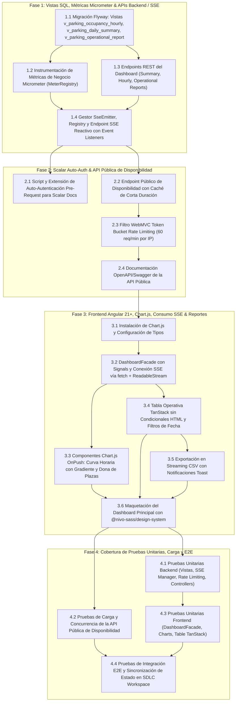

# Tareas de Implementación: Dashboard Analítico, SSE y API Pública (feat-nivo-dashboard)

## Execution DAG & Agent Routing

---

## Fase 1: Database Views, Micrometer Metrics & Backend Analytics APIs / SSE

- [ ] 1.1 Crear migración Flyway `V5__create_dashboard_views_and_analytics.sql` con las vistas analíticas `v_parking_occupancy_hourly`, `v_parking_daily_summary` y `v_parking_operational_report` con índices sobre `entry_time`, `exit_time` y `status`. _(Ref: `tsk-1790303890008384068`)_
- [ ] 1.2 Implementar `ParkingMetricsManager` con `MeterRegistry` para instrumentar `parking.occupancy.rate`, `parking.slots.*`, `parking.revenue.daily` y contadores de check-in/check-out. _(Ref: `tsk-1790303890008384068`)_
- [ ] 1.3 Desarrollar los casos de uso y repositorios JPA/JDBC para consultas analíticas agregadas: `GetDashboardSummaryUseCase`, `GetHourlyOccupancyUseCase` y `GetOperationalReportUseCase`. _(Ref: `tsk-anc-42`)_
- [ ] 1.4 Exponer controladores REST WebMVC `DashboardController` (`/dashboard/summary`, `/dashboard/occupancy-hourly`) y `ReportsController` (`/reports/operational`, `/reports/operational/csv`). _(Ref: `tsk-anc-42`)_
- [ ] 1.5 Implementar `DashboardSseRegistry` para gestión concurrente de `SseEmitter`, tarea programada de heartbeat cada 15s y desregistro seguro en timeout/error/completion. _(Ref: `tsk-1790303894823790364`)_
- [ ] 1.6 Conectar listeners de eventos de dominio (`CheckinVehicle`, `CheckoutVehicle`, `PaymentCompleted`) con el emisor SSE para transmitir eventos reactivos `occupancy-update` y `revenue-update`. _(Ref: `tsk-1790303894823790364`)_

## Fase 2: Scalar Pre-Request Auto-Auth & Public Availability API with Rate Limiting

- [ ] 2.1 Configurar script hook de auto-autenticación y extensión `x-pre-request` en la integración de Scalar para autenticar automáticamente credenciales de demostración y enviar el token Bearer. _(Ref: `tsk-1790303901093186402`)_
- [ ] 2.2 Diseñar y programar el filtro WebMVC `PublicApiRateLimitFilter` aplicando el algoritmo Token Bucket con límite de 60 req/min por IP e inyección de cabeceras `X-RateLimit-*` y `Retry-After`. _(Ref: `tsk-anc-48`)_
- [ ] 2.3 Implementar el caso de uso y controlador `PublicAvailabilityController` (`GET /api/v1/public/parkings/{parkingId}/availability`) con caché en memoria de 30s (`Cache-Control: public, max-age=30`). _(Ref: `tsk-anc-48`, `tsk-anc-45`)_
- [ ] 2.4 Documentar el endpoint público en OpenAPI con `@Operation`, `@ApiResponse` (200, 404, 429) y ejemplos de payload JSON para desarrolladores externos. _(Ref: `tsk-anc-47`, `tsk-anc-45`)_
- [ ] 2.5 Habilitar acceso no autenticado a `/api/v1/public/**` en `SecurityChain`. _(Ref: `tsk-anc-45`)_

## Fase 3: Angular Dashboard UI, Chart.js Integration, SSE Consumption & CSV Export

- [ ] 3.1 Añadir dependencia `chart.js` a `apps/web/package.json` y verificar compatibilidad en el entorno de compilación de Angular 21+. _(Ref: `tsk-1790303907994475120`)_
- [ ] 3.2 Construir `DashboardFacade` en Angular con signals reactivos (`summary`, `occupancyHourly`, `reports`, `isStreaming`), y lógica de consumo de stream SSE mediante `fetch` + `ReadableStream` con Bearer token y reconexión exponencial. _(Ref: `tsk-1790303907994475120`, `tsk-anc-43`)_
- [ ] 3.3 Desarrollar componente de gráfico de curva horaria `OccupancyTrendChartComponent` (`OnPush`) con gradiente vertical, tensión suave y líneas de umbral de capacidad. _(Ref: `tsk-1790303907994475120`, `tsk-anc-43`)_
- [ ] 3.4 Desarrollar componente de dona `SlotDistributionDonutChartComponent` (`OnPush`) para desglose de plazas libres/ocupadas/reservadas y por tipo de vehículo. _(Ref: `tsk-1790303907994475120`, `tsk-anc-43`)_
- [ ] 3.5 Implementar componente `OperationalReportsTableComponent` con `@tanstack/angular-table` encapsulando renderers en las columnas sin escaleras condicionales `@if` en templates, con paginación y filtro de fecha. _(Ref: `tsk-anc-43`, `tsk-anc-41`)_
- [ ] 3.6 Desarrollar acción de descarga continua por streaming CSV en `DashboardFacade` con notificación toast (`@ngxpert/hot-toast`). _(Ref: `tsk-anc-43`, `tsk-anc-41`)_
- [ ] 3.7 Integrar la vista completa `DashboardPage` utilizando rigurosamente componentes del `@nivo-sass/design-system` (`nv-card`, `nv-badge`, `nv-button`, `nv-typography`, `nv-input`, `nv-loader`). _(Ref: `tsk-anc-43`, `tsk-anc-41`)_

## Fase 4: E2E and Unit Testing Coverage

- [ ] 4.1 Escribir pruebas unitarias en `PublicAvailabilityControllerTest`, verificando respuestas 200, 404 y códigos 429 ante agotamiento del token bucket. _(Ref: `tsk-anc-46`)_
- [ ] 4.2 Escribir pruebas unitarias en `DashboardSseManagerTest` y `ParkingMetricsManagerTest`, validando emisión de snapshots y contadores de Micrometer. _(Ref: `tsk-anc-44`)_
- [ ] 4.3 Ejecutar pruebas de carga ligera simulada en el endpoint de disponibilidad para comprobar la resiliencia del caché y del rate limiter. _(Ref: `tsk-anc-46`)_
- [ ] 4.4 Escribir pruebas unitarias de frontend (`dashboard.facade.spec.ts`, `occupancy-trend-chart.spec.ts`, `operational-reports-table.spec.ts`). _(Ref: `tsk-anc-44`)_
- [ ] 4.5 Ejecutar la suite completa de pruebas en frontend (`bun test`) y backend (`./gradlew test`) asegurando 0 regresiones. _(Ref: `tsk-anc-44`)_
